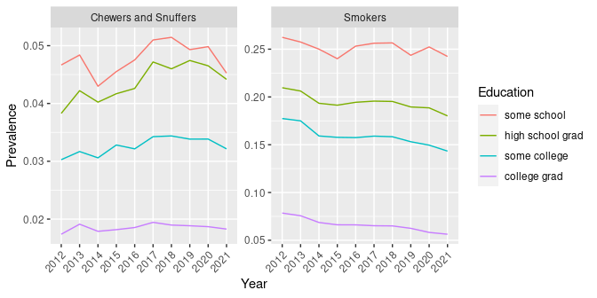
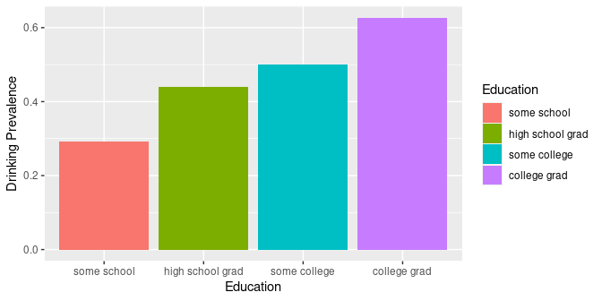
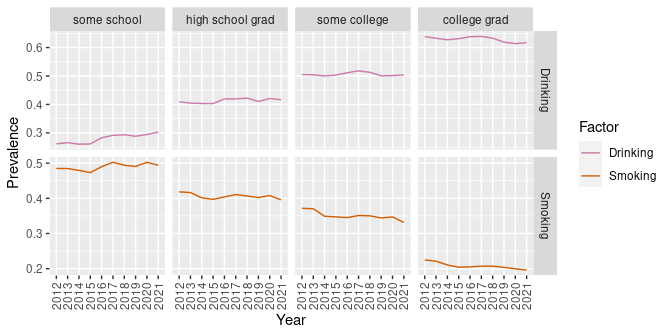

## SQL Examples: Smoking and Drinking

This is a demo of some basic SQL `SELECT` queries using BRFSS data from: 
http://www.cdc.gov/brfss/. 

We have downloaded the data for each respondent for the years 2012 through 2021. This dataset has 4,506,254 rows and 840 columns when [combined into a dataframe](get-brfss-data.md).

This dataset will be too large to fit in memory for most desktop and laptop 
computers. When this entire dataset is loaded into memory as an R dataframe, it consumes almost 30 GB of RAM. As of 2023, most workstations have only 16 GB of RAM or less.

Instead, we have [exported](download_brfss_into_duckdb.R) the data into a DuckDB database file. This allows access to just the data we need without loading all of it into memory at once. We have also limited the number of variables to only those present (359) in the first year's (2012) dataset.

The CDC has provided a 
[codebook](https://www.cdc.gov/brfss/annual_data/2021/pdf/codebook21_llcp-v2-508.pdf) 
for use in understanding variables and codes. In particular, we will focus on tobacco use and alcohol consumption in 
the state of Washington.

## Setup

Load the required R packages, installing as needed.


```r
if(!requireNamespace("pacman", quietly = TRUE)) install.packages("pacman")
pacman::p_load(knitr, dplyr, ggplot2, tidyr, stringr, duckdb, readr)
```

Set `knitr` rendering options, the number of digits to display, and a palette.


```r
opts_chunk$set(tidy=FALSE, cache=FALSE)
options(digits=4)
cbPalette <- c("#CC79A7", "#D55E00", "#999999", "#0072B2", "#009E73")
```

Connect to the DuckDB database file.


```r
ddb_fn <- file.path("data", "brfss_data.duckdb")
con <- duckdb::dbConnect(duckdb(), ddb_fn)
```

## Table Size

Print the number of rows and columns, as well as number of indexes.


```r
sql <- "SELECT COUNT(*) AS rows FROM brfss;"
rs <- dbGetQuery(con, sql)
cat(rs$rows, "row(s)")
```

```
## 4506254 row(s)
```

```r
sql <- "SELECT * FROM brfss LIMIT 1;"
rs <- dbGetQuery(con, sql)
cat(ncol(rs), "column(s)")
```

```
## 359 column(s)
```

```r
sql <- "select * from duckdb_indexes;"
rs <- dbGetQuery(con, sql)
cat(nrow(rs), "index(es)")
```

```
## 1 index(es)
```

## Count Respondents by Year

Let's count (`COUNT`) the number of respondents per year (`GROUP BY`) in 
Washington state (`_STATE = 53`), sorting by year (`ORDER BY`).


```r
sql <- "SELECT IYEAR AS Year, COUNT(*) AS Respondents 
        FROM brfss 
        WHERE _STATE = 53 
        GROUP BY IYEAR 
        ORDER BY IYEAR;"
dbGetQuery(con, sql)
```

```
##    Year Respondents
## 1  2012       15319
## 2  2013       11158
## 3  2014       10086
## 4  2015       16105
## 5  2016       14263
## 6  2017       13289
## 7  2018       13106
## 8  2019       12987
## 9  2020       12673
## 10 2021       12830
## 11 2022         568
```

## Respondents per Education Level

Look at the number of respondents in 2021 and aggregate by education level.


```r
sql <- "SELECT _EDUCAG AS Education, COUNT(*) AS Respondents 
        FROM brfss 
        WHERE IYEAR = 2021 AND _STATE = 53 
        GROUP BY _EDUCAG 
        ORDER BY _EDUCAG;"
dbGetQuery(con, sql)
```

```
##   Education Respondents
## 1         1         618
## 2         2        2543
## 3         3        3693
## 4         4        5884
## 5         9          92
```

The education level (`_EDUCAG`) is an integer from 1-4 (or 9 meaning 
"Don't know", "Missing", etc.). Do we see a trend? Is our sample skewed?

## Count Smokers by Education Level

Use the `SMOKDAY2` variable to see if the survey respondent is
a "smoker" or not. A value of `1` (Every day) or `2` (Some days) means 
"is a smoker".


```r
sql <- "SELECT _EDUCAG AS Education, 
COUNT(SMOKDAY2) AS Smokers 
FROM brfss 
WHERE IYEAR = 2021 AND _STATE = 53 AND _EDUCAG <= 4 
AND (SMOKDAY2 = 1 OR SMOKDAY2 = 2) 
GROUP BY _EDUCAG 
ORDER BY _EDUCAG;"
dbGetQuery(con, sql)
```

```
##   Education Smokers
## 1         1     119
## 2         2     390
## 3         3     442
## 4         4     242
```

The number of respondents varies by education level, so we will 
calculate "prevalence" as a fraction of respondents per education level.

## Count Smokers by Education Level

We can get a count of smokers and total respondents per education level in one 
query by using the `IF()` function within the `COUNT()` function.


```r
sql <- "SELECT _EDUCAG AS Education, 
COUNT(*) AS Respondents, 
COUNT(IF(SMOKDAY2 = 1 OR SMOKDAY2 = 2, 1, NULL)) AS Smokers 
FROM brfss 
WHERE IYEAR = 2021 AND _STATE = 53 AND _EDUCAG <= 4 
GROUP BY _EDUCAG 
ORDER BY _EDUCAG;"
rs <- dbGetQuery(con, sql)
rs
```

```
##   Education Respondents Smokers
## 1         1         618     119
## 2         2        2543     390
## 3         3        3693     442
## 4         4        5884     242
```

The `IF()` condition `SMOKDAY2 = 1 OR SMOKDAY2 = 2` was taken from the `WHERE` 
clause. We had to make this change so that `COUNT(*)` counts all respondents.

## Smoking Prevalence by Education Level

We use functions from the `dplyr` package to calculate smoking prevalence. This
is the number of smokers as a fraction of respondents for each education level.


```r
smokers <- rs %>% group_by(Education) %>% 
  mutate(`Smoking Prevalence` = Smokers/Respondents)
smokers
```

```
## # A tibble: 4 × 4
## # Groups:   Education [4]
##   Education Respondents Smokers `Smoking Prevalence`
##       <dbl>       <dbl>   <dbl>                <dbl>
## 1         1         618     119               0.193 
## 2         2        2543     390               0.153 
## 3         3        3693     442               0.120 
## 4         4        5884     242               0.0411
```

## Relabel Education Level

Now, we relabel the codes for education level to meaningful text strings. We 
abbreviate the "Value Label" text descriptions from the codebook as follows.


```r
edu.labels <- c("some school", "high school grad", "some college", "college grad")
smokers$Education <- factor(smokers$Education, levels = 1:4, labels = edu.labels)
smokers
```

```
## # A tibble: 4 × 4
## # Groups:   Education [4]
##   Education        Respondents Smokers `Smoking Prevalence`
##   <fct>                  <dbl>   <dbl>                <dbl>
## 1 some school              618     119               0.193 
## 2 high school grad        2543     390               0.153 
## 3 some college            3693     442               0.120 
## 4 college grad            5884     242               0.0411
```

## Smoking Prevalence by Education Level


```r
ggplot(smokers, aes(x = Education, y = `Smoking Prevalence`, fill = Education)) +
  geom_bar(stat = "identity")
```

<!-- -->

## Count Smokers by Education and Year

How has smoking changed from 2012 to 2021?


```r
sql <- "SELECT IYEAR AS Year, _EDUCAG AS Education, 
COUNT(*) AS Respondents, 
COUNT(IF(SMOKDAY2 = 1 OR SMOKDAY2 = 2, 1, NULL)) AS Smokers
FROM brfss 
WHERE (IYEAR BETWEEN 2012 AND 2021)
AND _STATE = 53 
AND _EDUCAG <= 4 
GROUP BY IYEAR, _EDUCAG 
ORDER BY IYEAR, _EDUCAG DESC;"

rs <- dbGetQuery(con, sql)
smokers <- rs %>% group_by(Year, Education) %>% 
    mutate(`Smoking Prevalence` = Smokers/Respondents,
           Education = factor(Education, levels = 1:4, labels = edu.labels),
           Year = factor(Year))
```

## Smoking by Education and Year


```r
ggplot(smokers, aes(x = Year, y = `Smoking Prevalence`, 
                    color = Education, group = Education)) + geom_line()
```

<!-- -->

## Smokers, Chewers, and Snuffers

`SMOKDAY2` represents smoking and `USENOW3` represents "chewing" or "snuffing".


```r
sql <- "SELECT IYEAR AS Year, _EDUCAG AS Education, 
COUNT(*) AS Respondents, 
COUNT(IF(SMOKDAY2 = 1 OR SMOKDAY2 = 2, 1, NULL)) AS Smokers,
COUNT(IF(USENOW3 = 1 OR USENOW3 = 2, 1, NULL)) AS Chewers
FROM brfss 
WHERE (IYEAR BETWEEN 2012 AND 2021)
AND _STATE = 53 
AND _EDUCAG <= 4 
GROUP BY IYEAR, _EDUCAG 
ORDER BY IYEAR, _EDUCAG DESC;"

rs <- dbGetQuery(con, sql)
tobacco_use <- rs %>% group_by(Year, Education) %>% 
  mutate(Smokers = Smokers/Respondents, 
         `Chewers or Snuffers` = Chewers/Respondents) %>%
  mutate(Education = factor(Education, levels = 1:4, labels = edu.labels),
         Year = factor(Year)) %>% 
  select(-Respondents, -Chewers) %>%
  pivot_longer(c(-Year, -Education), names_to = "Type", values_to = "Prevalence")
```

## Smokers, Chewers, and Snuffers


```r
ggplot(tobacco_use, aes(x = Year, y = Prevalence, 
                        color = Education, group = Education)) +
  geom_line() + facet_grid(. ~ Type) + 
  theme(axis.text.x = element_text(angle = 45, vjust = 1, hjust = 1))
```

<!-- -->

## Count Drinkers by Education Level

The `DRNKANY5` variable stores a value indicating if the survey respondent has 
consumed an alcoholic drink in the past 30 days. We will use this value to 
indicate if the survey respondent is currently a "drinker" or not. A value of
`1` means "is a drinker". Again, we will just look at Washington state in 2021.


```r
sql <- "SELECT _EDUCAG AS Education, 
COUNT(*) AS Respondents, 
COUNT(IF(DRNKANY5 = 1, 1, NULL)) AS Drinkers 
FROM brfss 
WHERE IYEAR = 2021
AND _STATE = 53 
AND _EDUCAG <= 4 
GROUP BY _EDUCAG 
ORDER BY _EDUCAG DESC;"

rs <- dbGetQuery(con, sql)
```

## Drinking Prevalence by Education Level

Again, using `dplyr`, we can calculate drinking prevalence.


```r
drinkers <- rs %>% group_by(Education) %>% 
  mutate(`Drinking Prevalence` = Drinkers/Respondents,
         Education = factor(Education, levels = 1:4, labels = edu.labels))
drinkers
```

```
## # A tibble: 4 × 4
## # Groups:   Education [4]
##   Education        Respondents Drinkers `Drinking Prevalence`
##   <fct>                  <dbl>    <dbl>                 <dbl>
## 1 college grad            5884     3682                 0.626
## 2 some college            3693     1849                 0.501
## 3 high school grad        2543     1118                 0.440
## 4 some school              618      181                 0.293
```

## Drinking Prevalence by Education Level


```r
ggplot(drinkers, aes(x = Education, y = `Drinking Prevalence`, fill = Education)) +
  geom_bar(stat = "identity")
```

<!-- -->

## Count Drinkers by Education and Year

Let's see how drinking compares from 2012 to 2021.


```r
sql <- "SELECT IYEAR AS Year, _EDUCAG AS Education, 
COUNT(*) AS Respondents, 
COUNT(IF(DRNKANY5 = 1, 1, NULL)) AS Drinkers 
FROM brfss 
WHERE (IYEAR BETWEEN 2012 AND 2021)
AND _STATE = 53 
AND _EDUCAG <= 4 
GROUP BY IYEAR, _EDUCAG 
ORDER BY IYEAR, _EDUCAG DESC;"

rs <- dbGetQuery(con, sql)
drinkers <- rs %>% group_by(Year, Education) %>% 
    mutate(`Drinking Prevalence` = Drinkers/Respondents,
           Education = factor(Education, levels = 1:4, labels = edu.labels))
```

## Drinking by Education and Year


```r
ggplot(drinkers, aes(x = Year, y = `Drinking Prevalence`, 
                     color = Education, group = Education)) + geom_line()
```

<!-- -->

## Drinkers and Binge Drinkers

Let's compare drinkers (`DRNKANY5 = 1`) and binge drinkers (`_RFBING5 = 2`) 
for 2012-2021. Binge drinkers are defined as males having five or more drinks 
on one occasion and females having four or more drinks on one occasion


```r
sql <- "SELECT IYEAR AS Year, _EDUCAG AS Education, 
COUNT(*) AS Respondents, 
COUNT(IF(DRNKANY5 = 1, 1, NULL)) AS Drinkers, 
COUNT(IF(_RFBING5 = 2, 1, NULL)) AS BingeDrinkers 
FROM brfss 
WHERE (IYEAR BETWEEN 2012 AND 2021)
AND _STATE = 53 
AND _EDUCAG <= 4 
GROUP BY IYEAR, _EDUCAG 
ORDER BY IYEAR, _EDUCAG DESC;"

rs <- dbGetQuery(con, sql)
drinkers <- rs %>% group_by(Year, Education) %>% 
  mutate(Drinkers = Drinkers/Respondents,
         `Binge Drinkers` = BingeDrinkers/Respondents,
         Education = factor(Education, levels = 1:4, labels = edu.labels)) %>% 
  select(-Respondents, -BingeDrinkers) %>%
  pivot_longer(c(-Year, -Education), names_to = "Type", values_to = "Prevalence")
```

## Drinkers and Binge Drinkers


```r
ggplot(drinkers, aes(x = Year, y = Prevalence, 
                     color = Education, group = Education)) +
  geom_line() + facet_grid(. ~ Type) + 
  theme(axis.text.x = element_text(angle = 45, vjust = 1, hjust = 1))
```

<!-- -->

## Why so many queries?

We can retrieve the smoking and drinking data with a single query:


```r
sql <- "SELECT IYEAR AS Year, _EDUCAG AS Education, 
COUNT(*) AS Respondents, 
COUNT(IF(SMOKDAY2 = 1 OR SMOKDAY2 = 2, 1, NULL)) AS Smokers, 
COUNT(IF(DRNKANY5 = 1, 1, NULL)) AS Drinkers 
FROM brfss 
WHERE (IYEAR BETWEEN 2012 AND 2021)
AND _STATE = 53 
AND _EDUCAG <= 4 
GROUP BY IYEAR, _EDUCAG 
ORDER BY IYEAR, _EDUCAG;"

rs <- dbGetQuery(con, sql)
consumers <- rs %>% group_by(Year, Education) %>% 
  mutate(Smoking=Smokers/Respondents, 
         Drinking=Drinkers/Respondents,
         Education = factor(Education, levels = 1:4, labels = edu.labels))
```

From this dataframe, just subset as needed to produce tables and plots.

## Smoking and Drinking Prevalence


```r
consumers %>% head()
```

```
## # A tibble: 6 × 7
## # Groups:   Year, Education [6]
##   Year  Education        Respondents Smokers Drinkers Smoking Drinking
##   <chr> <fct>                  <dbl>   <dbl>    <dbl>   <dbl>    <dbl>
## 1 2012  some school              856     214      291  0.25      0.340
## 2 2012  high school grad        3512     707     1700  0.201     0.484
## 3 2012  some college            4635     728     2650  0.157     0.572
## 4 2012  college grad            6280     387     4330  0.0616    0.689
## 5 2013  some school              581     147      196  0.253     0.337
## 6 2013  high school grad        2578     486     1242  0.189     0.482
```

## Smoking and Drinking in Long Format

To facilitate plotting, we will want to group by consumption type. To do this,
we will need to convert the data structure from "wide" to "long" format. The
`pivot_longer()` function of the `tidyr` package makes this easy.


```r
consumers <- consumers %>% 
  select(Year, Education, Smoking, Drinking) %>% 
  pivot_longer(c(Smoking, Drinking), 
               names_to = "Factor", values_to = "Prevalence")
consumers %>% head()
```

```
## # A tibble: 6 × 4
## # Groups:   Year, Education [3]
##   Year  Education        Factor   Prevalence
##   <chr> <fct>            <chr>         <dbl>
## 1 2012  some school      Smoking       0.25 
## 2 2012  some school      Drinking      0.340
## 3 2012  high school grad Smoking       0.201
## 4 2012  high school grad Drinking      0.484
## 5 2012  some college     Smoking       0.157
## 6 2012  some college     Drinking      0.572
```

## Smoking and Drinking Prevalence


```r
ggplot(consumers, aes(x = Year, y = Prevalence, group = Factor, color = Factor)) + 
    geom_line() + facet_grid(Factor ~ Education, scales = "free_y") +
    theme(axis.text.x = element_text(angle = 90, vjust = 0.5, hjust = 1)) + 
    scale_color_manual(values = cbPalette)
```

<!-- -->

## Alternative to Writing SQL

Wouldn't it be nice to do this in R without having to write SQL too? 

You can use the `dbplyr` package, which will automatically load if `dplyr` 
is loaded, to translate R code to SQL for you. This allows you to use R
code instead if SQL to get your data from the database.


```r
brfss_data <- tbl(con, "brfss")
result <- brfss_data %>% 
  rename("Year" = IYEAR, "Education" = `_EDUCAG`, State = `_STATE`) %>% 
  select(Year, Education, State, SMOKDAY2, DRNKANY5) %>%
  filter(Year >= 2012, Year <= 2021, State == 53, Education <= 4)
```

## View the SQL Query

While this didn't actually execute the query and return the dataset, it did
create a SQL query that we'll use next.


```r
result %>% show_query()
```

```
## <SQL>
## SELECT
##   IYEAR AS "Year",
##   _EDUCAG AS Education,
##   _STATE AS State,
##   SMOKDAY2,
##   DRNKANY5
## FROM brfss
## WHERE
##   (IYEAR >= 2012.0) AND
##   (IYEAR <= 2021.0) AND
##   (_STATE = 53.0) AND
##   (_EDUCAG <= 4.0)
```

## Prepare Data for Plotting

To actually execute the SQL query, we use `collect()`. Then we perform the same steps as we did previously on the SQL query results, but using R instead of a mix of R and SQL.


```r
consumers <- collect(result) %>% 
  mutate(Smoker = ifelse(SMOKDAY2 %in% 1:2, 1, 0)) %>% 
  mutate(Drinker = ifelse(DRNKANY5 == 1, 1, 0)) %>% 
  group_by(Year, Education) %>% 
  summarize(Smoking = sum(Smoker, na.rm = TRUE)/n(),
            Drinking = sum(Drinker, na.rm = TRUE)/n(),
            .groups = "keep") %>% 
  mutate(Education = factor(Education, levels = 1:4, labels = edu.labels)) %>% 
  pivot_longer(c(Smoking, Drinking), 
               names_to = "Factor", values_to = "Prevalence")
```

## Plot dbplyr Results


```r
# Use the same ggplot() command as before
ggplot(consumers, aes(x = Year, y = Prevalence, group = Factor, color = Factor)) + 
    geom_line() + facet_grid(Factor ~ Education, scales="free_y") + 
    theme(axis.text.x = element_text(angle = 90, vjust = 0.5, hjust = 1)) + 
    scale_color_manual(values = cbPalette)
```

<!-- -->

## Speeding up Queries

If we retrieve all of the data for Washington state respondents for 2012-2021,
we can just use R commands for subsetting and work entirely from memory.


```r
# Get all Washington State data from 2012-2021 from database as a dataframe
brfss_data <- tbl(con, "brfss")
result <- brfss_data %>% 
  filter(IYEAR >= 2012, IYEAR <= 2021, `_STATE` == 53)
brfsswa1221 <- collect(result)
dim(brfsswa1221)
```

```
## [1] 131816    359
```

```r
# Remove 100 columns that contain only NA , zero (0), or the empty string ('')
brfsswa1221 <- brfsswa1221 %>% select_if(~ !(all(is.na(.) | . == 0 | . == "")))
dim(brfsswa1221)
```

```
## [1] 131816    249
```

## Check on Memory, Write to File

We will compare the size of the dataset in memory (RAM) and as a file (RDS).


```r
# Report data table size and dimensions
cat("The data table consumes", object.size(brfsswa1221) / 1024^2, "MB", 
    "with", dim(brfsswa1221)[1], "observations and", 
    dim(brfsswa1221)[2], "variables", "\n")
```

```
## The data table consumes 250.7 MB with 131816 observations and 249 variables
```

```r
# Save as a RDS and check on the size
filename <- file.path("data", "brfsswa1221.rds")
if (! file.exists(filename)) saveRDS(brfsswa1221, filename)
cat(paste(c("Size of RDS file is", 
            round(file.size(filename) / 1024^2, 1), "MB", "\n")))
```

```
## Size of RDS file is 8.5 MB
```

In the future, if we only want to work with Washington State data from 2012-2021, then we can just read from the RDS file instead of using the Duck DB database.

## Reproduce Results without SQL

We can test our subset by reproducing our SQL query with R commands as before.


```r
consumers <- brfsswa1221 %>%
  rename("Year" = IYEAR, "Education" = `_EDUCAG`, State = `_STATE`) %>% 
  select(Year, Education, State, SMOKDAY2, DRNKANY5) %>%
  filter(Year >= 2012, Year <= 2021, State == 53, Education <= 4) %>% 
  mutate(Smoker = ifelse(SMOKDAY2 %in% 1:2, 1, 0)) %>% 
  mutate(Drinker = ifelse(DRNKANY5 == 1, 1, 0)) %>% 
  group_by(Year, Education) %>% 
  summarize(Smoking = sum(Smoker, na.rm = TRUE)/n(),
            Drinking = sum(Drinker, na.rm = TRUE)/n(),
            .groups = "keep") %>% 
  mutate(Education = factor(Education, levels = 1:4, labels = edu.labels)) %>% 
  pivot_longer(c(Smoking, Drinking), 
               names_to = "Factor", values_to = "Prevalence")
```

## Smoking and Drinking Prevalence


```r
# Use the same ggplot() command as used earlier
ggplot(consumers, aes(x = Year, y = Prevalence, group = Factor, color = Factor)) + 
    geom_line() + facet_grid(Factor ~ Education, scales="free_y") + 
    theme(axis.text.x = element_text(angle = 90, vjust = 0.5, hjust = 1)) + 
    scale_color_manual(values = cbPalette)
```

<!-- -->

## Compare States: FIPS Codes

We can easily compare states if we know the codes used in the BRFSS dataset. The
codes are known as [FIPS codes](https://transition.fcc.gov/oet/info/maps/census/fips/fips.txt). We can 
lookup the FIPS code for Pacific Northwest (PNW) states like this:


```r
# Get a table of state FIPS codes and state names
fips_fn <- file.path("data", "fips.txt")
if (! file.exists(fips_fn)) {
  url <- "https://www.cdc.gov/brfss/annual_data/1996/files/fipscode.txt"
  download.file(url, fips_fn)
}

# Cleanup data
fips <- suppressMessages(read_fwf(fips_fn, skip = 3, n_max = 51)) %>% 
  rename("state_fips" = X1, "state_name" = X2) %>% 
  mutate(state_fips = as.numeric(state_fips)) %>%
  mutate(state_name = str_to_title(state_name)) %>%
  mutate(state_name = str_replace(state_name, " Of ", " of "))

# Create a vector of PNW state FIPS codes to use for filtering
pnw_state_fips <- fips %>% 
  filter(state_name %in% 
           c("Alaska", "Idaho", "Montana", "Oregon", "Washington")) %>%
  pull(state_fips)
```

## Compare States: Count Respondents

To see these FIPS codes used in action, let's count the number of respondents 
per PNW state for the 2012-2021 timespan.


```r
brfss_data <- tbl(con, "brfss")

result <- brfss_data %>% rename(State = `_STATE`, "Year" = IYEAR) %>% 
  filter(State %in% pnw_state_fips, Year >= 2012, Year <= 2021) %>%
  group_by(State) %>% summarize(N = n()) %>% arrange(desc(N))

inner_join(fips, collect(result), by = c('state_fips' = 'State'))
```

```
## # A tibble: 5 × 3
##   state_fips state_name      N
##        <dbl> <chr>       <dbl>
## 1          2 Alaska      37843
## 2         16 Idaho       54889
## 3         30 Montana     67848
## 4         41 Oregon      55492
## 5         53 Washington 131816
```

## Compare States: Prep for Plot


```r
brfss_data <- tbl(con, "brfss")

result <- brfss_data %>% 
  rename("Year" = IYEAR, "Education" = `_EDUCAG`, State = `_STATE`) %>% 
  select(Year, Education, State, SMOKDAY2, DRNKANY5) %>%
  filter(Year >= 2012, Year <= 2021, Education <= 4, State %in% pnw_state_fips)

consumers <- collect(result) %>% 
  mutate(Smoker = ifelse(SMOKDAY2 %in% 1:2, 1, 0)) %>% 
  mutate(Drinker = ifelse(DRNKANY5 == 1, 1, 0)) %>% 
  group_by(Year, State, Education) %>% 
  summarize(Smoking = sum(Smoker, na.rm = TRUE)/n(),
            Drinking = sum(Drinker, na.rm = TRUE)/n(),
            .groups = "keep") %>% 
  mutate(Education = factor(Education, levels = 1:4, labels = edu.labels)) %>% 
  pivot_longer(c(Smoking, Drinking), 
               names_to = "Factor", values_to = "Prevalence") %>%
  inner_join(fips, by = c('State' = 'state_fips')) %>% 
  mutate(State = state_name) %>% select(-state_name)
```

## Compare States: Plot


```r
# Use the same ggplot() command as before, modified to color by state
ggplot(consumers, aes(x = Year, y = Prevalence, group = State, color = State)) + 
    geom_line() + facet_grid(Factor ~ Education, scales="free_y") + 
    theme(axis.text.x = element_text(angle = 90, vjust = 0.5, hjust = 1)) + 
    scale_color_manual(values = cbPalette)
```

<!-- -->

## Compare other Variables

Now that you know how to query the database, compare other variables, such as:

- Smoking and drinking by income (`_INCOMG`) or race (`_RACE`)
- Binge drinking (`_RFBING5`) by gender (`SEX`) or age (`_AGE80`)
- BMI category (`_BMI5CAT`) and exercise (`EXERANY2`) or sleep (`SLEPTIM1`)
- Health care access (`HLTHPLN1`) and household income (`INCOME2`)
- Stress (`QLSTRES2`) and marital status (`MARITAL`)
- Internet use (`INTERNET`) and mental health (`MENTHLTH`) 
- Life satisfaction (`LSATISFY`) and social/emotional support (`EMTSUPRT)`
- What are *you* curious about?

## Close Database Connection

Once we are done with the database, we can close the connection to it.


```r
# Close connection
dbDisconnect(con, shutdown = TRUE)
```

### What if I forget?

If you forget to close the connection, you will get an error if you try to reopen it.

```
Failed to open database: IO Error: 
Could not set lock on file "data/brfss_data.duckdb": 
Resource temporarily unavailable
```

### Write-Ahead-Log (`.wal`) Files

If you close your R session without first closing the connection, a `.wal` file 
may be left behind, preventing new connections. This file represents a "lock" 
on the database. The lock is considered "stale" if the process that created it 
has ended but the file remains. This file can be removed manually, if absolutely 
necessary.
