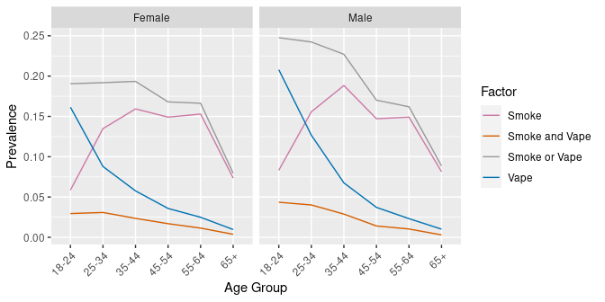

  
## SQL Examples: Smoking and Drinking
  
This is a demo of some basic SQL `SELECT` queries using BRFSS data from: 
http://www.cdc.gov/brfss/. 

We have downloaded the data for each respondent for the years 2017 through 2021.

This dataset has 2,146,371 rows and 358 columns.

This dataset will be too large to fit in RAM memory for most desktop and laptop 
computers.

Instead, we have [exported](download_brfss_into_duckdb.R) the data into a DuckDB database file.

The CDC has provided a 
[codebook](https://www.cdc.gov/brfss/annual_data/2021/pdf/codebook21_llcp-v2-508.pdf) 
for use in understanding variables and codes.

In particular, we will focus on tobacco use and alcohol consumption in 
the state of Washington.

## Install Packages and Set Options

Load the required R packages, installing as necessary.


```r
# Attach packages, installing as needed
if(!requireNamespace("pacman", quietly = TRUE)) install.packages("pacman")
pacman::p_load(knitr, dplyr, ggplot2, tidyr, data.table, duckdb)
```

Set `knitr` rendering options and the default number of digits for printing.


```r
opts_chunk$set(tidy=FALSE, cache=TRUE)
options(digits=4)
```

## Connect to DuckDB Database

Connect to the DuckDB database file.


```r
ddb_fn <- "brfss_data.duckdb"
con <- duckdb::dbConnect(duckdb(), ddb_fn)
```

## Table Size

Print the number of rows and columns, as well as number of indexes.


```r
sql <- "SELECT COUNT(*) AS rows FROM brfss_data;"
rs <- dbGetQuery(con, sql)
cat(rs$rows, "rows")
```

```
## 2146371 rows
```

```r
sql <- "SELECT * FROM brfss_data LIMIT 1;"
rs <- dbGetQuery(con, sql)
cat(ncol(rs), "columns")
```

```
## 358 columns
```

```r
sql <- "select * from duckdb_indexes;"
rs <- dbGetQuery(con, sql)
cat(nrow(rs), "indexes")
```

```
## 0 indexes
```

## Count Respondents by Year

Let's count (`COUNT`) the number of respondents per year (`GROUP BY`) in 
Washington state (`_STATE = 53`), sorting by year (`ORDER BY`).


```r
sql <- "SELECT IYEAR AS Year, COUNT(*) AS Respondents 
        FROM brfss_data 
        WHERE _STATE = 53 
        GROUP BY IYEAR 
        ORDER BY IYEAR;"
dbGetQuery(con, sql)
```

```
##   Year Respondents
## 1 2017       13272
## 2 2018       13106
## 3 2019       12987
## 4 2020       12673
## 5 2021       12830
## 6 2022         568
```

## Respondents per Education Level

Look at the number of respondents in 2021 and aggregate by education level.


```r
sql <- "SELECT _EDUCAG AS Education, COUNT(*) AS Respondents 
        FROM brfss_data 
        WHERE IYEAR = 2021 AND _STATE = 53 
        GROUP BY _EDUCAG 
        ORDER BY _EDUCAG;"
dbGetQuery(con, sql)
```

```
##   Education Respondents
## 1         1         618
## 2         2        2543
## 3         3        3693
## 4         4        5884
## 5         9          92
```

The education level (`_EDUCAG`) is an integer from 1-4 (or 9 meaning 
"Don't know", "Missing", etc.). Do we see a trend? Is our sample skewed?

## Count Smokers by Education Level

Use the `USENOW3` variable to see if the survey respondent is
a smoker or not. A value of `1` (Every day) or `2` (Some days) means 
"is a smoker".


```r
sql <- "SELECT _EDUCAG AS Education, 
COUNT(USENOW3) AS Smokers 
FROM brfss_data 
WHERE IYEAR = 2021 AND _STATE = 53 AND _EDUCAG <= 4 
AND (USENOW3 = 1 OR USENOW3 = 2) 
GROUP BY _EDUCAG 
ORDER BY _EDUCAG;"
dbGetQuery(con, sql)
```

```
##   Education Smokers
## 1         1      28
## 2         2      96
## 3         3      83
## 4         4      87
```

The number of respondents varies by education level, so we will 
calculate "prevalence" as a fraction of respondents per education level.

## Count Smokers by Education Level

We can get a count of smokers and total respondents per education level in one 
query by using the `IF()` function within the `COUNT()` function.


```r
sql <- "SELECT _EDUCAG AS Education, 
COUNT(*) AS Respondents, 
COUNT(IF(USENOW3 = 1 OR USENOW3 = 2, 1, NULL)) AS Smokers 
FROM brfss_data 
WHERE IYEAR = 2021 AND _STATE = 53 AND _EDUCAG <= 4 
GROUP BY _EDUCAG 
ORDER BY _EDUCAG;"
rs <- dbGetQuery(con, sql)
rs
```

```
##   Education Respondents Smokers
## 1         1         618      28
## 2         2        2543      96
## 3         3        3693      83
## 4         4        5884      87
```

The `IF()` condition `USENOW3 = 1 OR USENOW3 = 2` was taken from the `WHERE` 
clause. We had to make this change so that `COUNT(*)` counts all respondents.

## Smoking Prevalence by Education Level

We use functions from the `dplyr` package to calculate smoking prevalence. This
is the number of smokers as a fraction of respondents for each education level.


```r
library(dplyr)
rs %>% group_by(Education) %>% 
    mutate(Smoking.Prevalence=Smokers/Respondents) -> smokers
smokers
```

```
## # A tibble: 4 × 4
## # Groups:   Education [4]
##   Education Respondents Smokers Smoking.Prevalence
##       <dbl>       <dbl>   <dbl>              <dbl>
## 1         1         618      28             0.0453
## 2         2        2543      96             0.0378
## 3         3        3693      83             0.0225
## 4         4        5884      87             0.0148
```

## Relabel Education Level

Now, we relabel the codes for education level to meaningful text strings. We 
abbreviate the "Value Label" text descriptions from the codebook as follows.


```r
edu.labels <- c("some school", "high school grad", 
                "some college", "college grad")
smokers$Education <- factor(smokers$Education, levels=1:4, labels=edu.labels)
smokers
```

```
## # A tibble: 4 × 4
## # Groups:   Education [4]
##   Education        Respondents Smokers Smoking.Prevalence
##   <fct>                  <dbl>   <dbl>              <dbl>
## 1 some school              618      28             0.0453
## 2 high school grad        2543      96             0.0378
## 3 some college            3693      83             0.0225
## 4 college grad            5884      87             0.0148
```

## Smoking Prevalence by Education Level


```r
library(ggplot2)
ggplot(data=smokers, aes(x=Education, y=Smoking.Prevalence, fill=Education)) +
    geom_bar(stat="identity")
```

<!-- -->

## Count Smokers by Education and Year

How has smoking changed from 2017 to 2021?


```r
sql <- "SELECT IYEAR AS Year, _EDUCAG AS Education, 
COUNT(*) AS Respondents, 
COUNT(IF(USENOW3 = 1 OR USENOW3 = 2, 1, NULL)) AS Smokers
FROM brfss_data 
WHERE (IYEAR BETWEEN 2017 AND 2021)
AND _STATE = 53 
AND _EDUCAG <= 4 
GROUP BY IYEAR, _EDUCAG 
ORDER BY IYEAR, _EDUCAG DESC;"

# The WHERE clause could also use: WHERE (IYEAR BETWEEN 2011 AND 2014)
# The WHERE clause could also use: WHERE (IYEAR >= 2011 and IYEAR <= 2014)
# But these will not take full advantage of our INDEX and will run slower.

rs <- dbGetQuery(con, sql)
rs %>% group_by(Year, Education) %>% 
    mutate(Smoking.Prevalence=Smokers/Respondents) -> smokers
```

## Smoking by Education and Year


```r
smokers$Education <- factor(smokers$Education, levels=1:4, labels=edu.labels)
smokers$Year <- factor(smokers$Year)
ggplot(data=smokers, aes(x=Education, y=Smoking.Prevalence, fill=Year)) +
    geom_bar(stat="identity", position=position_dodge(), colour="black")
```

<!-- -->

## Count Drinkers by Education Level

The `DRNKANY5` variable stores a value indicating if the survey respondent has 
consumed an alcoholic drink in the past 30 days. We will use this value to 
indicate if the survey respondent is currently a drinker or not. A value of
`1` means "is a drinker". Again, we will just look at Washington state in 2021.


```r
sql <- "SELECT _EDUCAG AS Education, 
COUNT(*) AS Respondents, 
COUNT(IF(DRNKANY5 = 1, 1, NULL)) AS Drinkers 
FROM brfss_data 
WHERE IYEAR = 2021
AND _STATE = 53 
AND _EDUCAG <= 4 
GROUP BY _EDUCAG 
ORDER BY _EDUCAG DESC;"

rs <- dbGetQuery(con, sql)
```

## Drinking Prevalence by Education Level

Again, using `dplyr`, we can calculate drinking prevalence.


```r
rs %>% group_by(Education) %>% 
    mutate(Drinking.Prevalence=Drinkers/Respondents) -> drinkers
drinkers$Education <- factor(drinkers$Education, levels=1:4, labels=edu.labels)
drinkers
```

```
## # A tibble: 4 × 4
## # Groups:   Education [4]
##   Education        Respondents Drinkers Drinking.Prevalence
##   <fct>                  <dbl>    <dbl>               <dbl>
## 1 college grad            5884     3682               0.626
## 2 some college            3693     1849               0.501
## 3 high school grad        2543     1118               0.440
## 4 some school              618      181               0.293
```

## Drinking Prevalence by Education Level


```r
ggplot(data=drinkers, aes(x=Education, y=Drinking.Prevalence, fill=Education)) +
    geom_bar(stat="identity")
```

<!-- -->

## Count Drinkers by Education and Year

Let's see how drinking compares from 2017 to 2021.


```r
sql <- "SELECT IYEAR AS Year, _EDUCAG AS Education, 
COUNT(*) AS Respondents, 
COUNT(IF(DRNKANY5 = 1, 1, NULL)) AS Drinkers 
FROM brfss_data 
WHERE (IYEAR BETWEEN 2011 AND 2021)
AND _STATE = 53 
AND _EDUCAG <= 4 
GROUP BY IYEAR, _EDUCAG 
ORDER BY IYEAR, _EDUCAG DESC;"

rs <- dbGetQuery(con, sql)
rs %>% group_by(Year, Education) %>% 
    mutate(Drinking.Prevalence=Drinkers/Respondents) -> drinkers
```

## Drinking by Education and Year


```r
drinkers$Education <- factor(drinkers$Education, levels=1:4, labels=edu.labels)
drinkers$Year <- factor(drinkers$Year)
ggplot(data=drinkers, aes(x=Education, y=Drinking.Prevalence, fill=Year)) +
    geom_bar(stat="identity", position=position_dodge(), colour="black")
```

<!-- -->

## Why so many queries?

We could have retrieved all of the data for the previous plots with a single
query:


```r
sql <- "SELECT IYEAR AS Year, _EDUCAG AS Education, 
COUNT(*) AS Respondents, 
COUNT(IF(USENOW3 = 1 OR USENOW3 = 2, 1, NULL)) AS Smokers, 
COUNT(IF(DRNKANY5 = 1, 1, NULL)) AS Drinkers 
FROM brfss_data 
WHERE (IYEAR BETWEEN 2017 AND 2021)
AND _STATE = 53 
AND _EDUCAG <= 4 
GROUP BY IYEAR, _EDUCAG 
ORDER BY IYEAR, _EDUCAG;"

rs <- dbGetQuery(con, sql)
rs %>% group_by(Year, Education) %>% 
    mutate(Smoking=Smokers/Respondents, 
           Drinking=Drinkers/Respondents) -> consumers
consumers$Education <- factor(consumers$Education, levels=1:4, 
                              labels=edu.labels)
consumers$Year <- factor(consumers$Year)
```

From this dataframe, just subset as needed to produce tables and plots.

## Smoking and Drinking Prevalence


```r
consumers
```

```
## # A tibble: 20 × 7
## # Groups:   Year, Education [20]
##    Year  Education        Respondents Smokers Drinkers Smoking Drinking
##    <fct> <fct>                  <dbl>   <dbl>    <dbl>   <dbl>    <dbl>
##  1 2017  some school              756      32      269  0.0423    0.356
##  2 2017  high school grad        2906     116     1308  0.0399    0.450
##  3 2017  some college            3856     115     2036  0.0298    0.528
##  4 2017  college grad            5693      93     3695  0.0163    0.649
##  5 2018  some school              757      18      231  0.0238    0.305
##  6 2018  high school grad        2876     130     1221  0.0452    0.425
##  7 2018  some college            4012      99     2074  0.0247    0.517
##  8 2018  college grad            5394      72     3402  0.0133    0.631
##  9 2019  some school              749      27      222  0.0360    0.296
## 10 2019  high school grad        2816     119     1219  0.0423    0.433
## 11 2019  some college            3910     112     1923  0.0286    0.492
## 12 2019  college grad            5445      82     3401  0.0151    0.625
## 13 2020  some school              691      17      228  0.0246    0.330
## 14 2020  high school grad        2809     105     1256  0.0374    0.447
## 15 2020  some college            3800     105     1961  0.0276    0.516
## 16 2020  college grad            5310      66     3232  0.0124    0.609
## 17 2021  some school              618      28      181  0.0453    0.293
## 18 2021  high school grad        2543      96     1118  0.0378    0.440
## 19 2021  some college            3693      83     1849  0.0225    0.501
## 20 2021  college grad            5884      87     3682  0.0148    0.626
```

## Smoking and Drinking in Long Format

To facilitate plotting, we will want to group by consumption type. To do this,
we will need to convert the data structure from "wide" to "long" format. The
`gather()` function of the `tidyr` package makes this easy.


```r
library(tidyr)
consumers <- consumers %>% 
    select(Year, Education, Smoking, Drinking) %>% 
    gather(key=Factor, value=Prevalence, -Year, -Education)
head(consumers, 8)
```

```
## # A tibble: 8 × 4
## # Groups:   Year, Education [8]
##   Year  Education        Factor  Prevalence
##   <fct> <fct>            <chr>        <dbl>
## 1 2017  some school      Smoking     0.0423
## 2 2017  high school grad Smoking     0.0399
## 3 2017  some college     Smoking     0.0298
## 4 2017  college grad     Smoking     0.0163
## 5 2018  some school      Smoking     0.0238
## 6 2018  high school grad Smoking     0.0452
## 7 2018  some college     Smoking     0.0247
## 8 2018  college grad     Smoking     0.0133
```

## Smoking and Drinking Prevalence


```r
ggplot(data=consumers, aes(x=Year, y=Prevalence, group=Factor, color=Factor)) + 
    geom_line() + facet_grid(Factor ~ Education, scales="free_y") +
    theme(axis.text.x = element_text(angle = 90, vjust = 0.5, hjust = 1))
```

<!-- -->

## Compare other Variables

Now that you know how to query the database, compare other variables, such as:

- Smoking and drinking by income (`_INCOMG`) or race (`_RACE`)
- Binge drinking (`_RFBING5`) by gender (`SEX`) or age (`_AGE80`)
- BMI category (`_BMI5CAT`) and exercise (`EXERANY2`) or sleep (`SLEPTIM1`)
- Health care access (`HLTHPLN1`) and household income (`INCOME2`)
- Stress (`QLSTRES2`) and marital status (`MARITAL`)
- Internet use (`INTERNET`) and mental health (`MENTHLTH`) 
- Life satisfaction (`LSATISFY`) and social/emotional support (`EMTSUPRT)`
- What are *you* curious about?

## Speeding up Queries

If we retrieve all of the data for Washington state respondents in 2017-2021,
we can just use R commands for subsetting and work entirely from memory.


```r
# Get a subset of the dataset for 2017-2021 and state of Washington
sql <- "SELECT * FROM brfss_data 
WHERE (IYEAR BETWEEN 2017 AND 2021) 
AND _STATE = 53;"

# Use a data.table instead of a data.frame for improved performance
library(data.table)
brfsswa1721 <- as.data.table(dbGetQuery(con, sql))

# Remove columns that contain only NA , zero (0), or the empty string ('')
brfsswa1721 <- brfsswa1721[, which(unlist(lapply(
    brfsswa1721, function(x) ! all(is.na(x) | x==0 | x=='')))), with=FALSE]
```

## Check on Memory, Write to File


```r
# Report data table size and dimensions
cat("The data table consumes", object.size(brfsswa1721) / 1024^2, "MB", 
    "with", dim(brfsswa1721)[1], "observations and", 
    dim(brfsswa1721)[2], "variables", "\n")
```

```
## The data table consumes 125.9 MB with 64868 observations and 246 variables
```

```r
# Save as a RDS and check on the size
filename <- "brfsswa1721.rds"
if (! file.exists(filename)) saveRDS(brfsswa1721, filename)
cat(paste(c("Size of RDS file is", 
            round(file.size(filename) / 1024^2, 1), "MB", "\n")))
```

```
## Size of RDS file is 5.3 MB
```

## Query, Aggregate and Factor

We can test our `data.table` by reproducing our SQL query with R commands.


```r
# Rename columns to match our SQL results
setnames(brfsswa1721, "IYEAR", "Year")
setnames(brfsswa1721, "_EDUCAG", "Education")

# Use order() to set sort order like in SQL
brfsswa1721 <- brfsswa1721[order(Year, Education)]

# Use DT[i, j, by=...] syntax to query and aggregate like in SQL
consumers <- brfsswa1721[Education <= 4, list(
    Smoking = sum(USENOW3 == 1 | USENOW3 == 2, na.rm = TRUE)/.N,
    Drinking = sum(DRNKANY5 == 1, na.rm = TRUE)/.N), 
    by = list(Year, Education)]

# Use the same factor() commands as before
edu.labels <- c("some school", "high school grad", 
                "some college", "college grad")
consumers$Education <- factor(consumers$Education, levels=1:4, 
                              labels=edu.labels)
consumers$Year <- factor(consumers$Year)
```

## Check Results


```r
consumers %>% data.frame()
```

```
##    Year        Education Smoking Drinking
## 1  2017      some school 0.04233   0.3558
## 2  2017 high school grad 0.03992   0.4501
## 3  2017     some college 0.02982   0.5280
## 4  2017     college grad 0.01634   0.6490
## 5  2018      some school 0.02378   0.3052
## 6  2018 high school grad 0.04520   0.4245
## 7  2018     some college 0.02468   0.5169
## 8  2018     college grad 0.01335   0.6307
## 9  2019      some school 0.03605   0.2964
## 10 2019 high school grad 0.04226   0.4329
## 11 2019     some college 0.02864   0.4918
## 12 2019     college grad 0.01506   0.6246
## 13 2020      some school 0.02460   0.3300
## 14 2020 high school grad 0.03738   0.4471
## 15 2020     some college 0.02763   0.5161
## 16 2020     college grad 0.01243   0.6087
## 17 2021      some school 0.04531   0.2929
## 18 2021 high school grad 0.03775   0.4396
## 19 2021     some college 0.02247   0.5007
## 20 2021     college grad 0.01479   0.6258
```

## Convert to Long Format


```r
# Use the same gather() command as before
consumers <- consumers %>% 
    gather(key=Factor, value=Prevalence, -Year, -Education)
consumers %>% head(16)
```

```
##    Year        Education  Factor Prevalence
## 1  2017      some school Smoking    0.04233
## 2  2017 high school grad Smoking    0.03992
## 3  2017     some college Smoking    0.02982
## 4  2017     college grad Smoking    0.01634
## 5  2018      some school Smoking    0.02378
## 6  2018 high school grad Smoking    0.04520
## 7  2018     some college Smoking    0.02468
## 8  2018     college grad Smoking    0.01335
## 9  2019      some school Smoking    0.03605
## 10 2019 high school grad Smoking    0.04226
## 11 2019     some college Smoking    0.02864
## 12 2019     college grad Smoking    0.01506
## 13 2020      some school Smoking    0.02460
## 14 2020 high school grad Smoking    0.03738
## 15 2020     some college Smoking    0.02763
## 16 2020     college grad Smoking    0.01243
```

## Smoking and Drinking Prevalence


```r
# User the same ggplot() command as before
ggplot(data=consumers, aes(x=Year, y=Prevalence, group=Factor, color=Factor)) + 
    geom_line() + facet_grid(Factor ~ Education, scales="free_y") + 
    theme(axis.text.x = element_text(angle = 90, vjust = 0.5, hjust = 1))
```

<!-- -->

## Close Database Connection

Once we are done with the database, we can close the connection to it.


```r
# Close connection
dbDisconnect(con, shutdown = TRUE)
```
