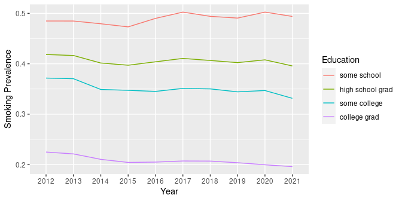
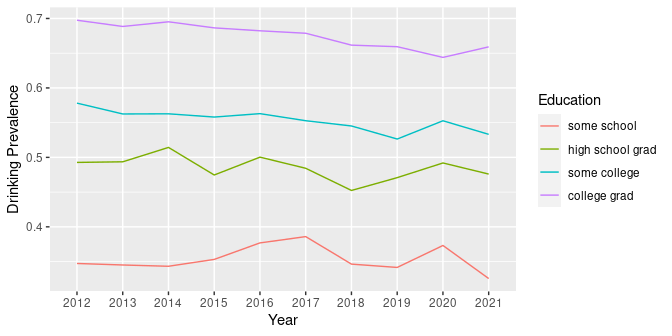
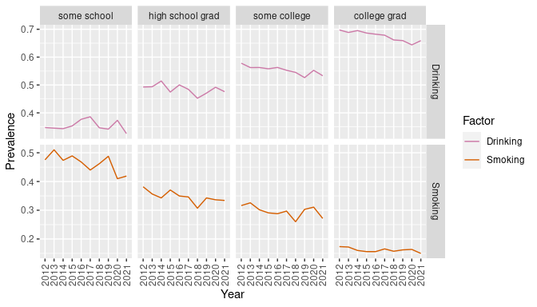

  
## SQL Examples: Smoking and Drinking
  
This is a demo of some basic SQL `SELECT` queries using BRFSS data from: 
http://www.cdc.gov/brfss/. 

We have downloaded the data for each respondent for the years 2012 through 2021.

This dataset has 4,506,254 rows and 359 columns.

This dataset will be too large to fit in RAM memory for most desktop and laptop 
computers.

Instead, we have [exported](download_brfss_into_duckdb.R) the data into a DuckDB database file. This allows access to just the data we need without loading all of it into memory at once.

The CDC has provided a 
[codebook](https://www.cdc.gov/brfss/annual_data/2021/pdf/codebook21_llcp-v2-508.pdf) 
for use in understanding variables and codes.

In particular, we will focus on tobacco use and alcohol consumption in 
the state of Washington.

## Install Packages and Set Options

Load the required R packages, installing as necessary.


```r
# Attach packages, installing as needed
if(!requireNamespace("pacman", quietly = TRUE)) install.packages("pacman")
pacman::p_load(knitr, dplyr, ggplot2, tidyr, duckdb)
```

Set `knitr` rendering options and the default number of digits for printing.


```r
opts_chunk$set(tidy=FALSE, cache=FALSE)
options(digits=4)
```

## Connect to DuckDB Database

Connect to the DuckDB database file.


```r
ddb_fn <- file.path("data", "brfss_data.duckdb")
con <- duckdb::dbConnect(duckdb(), ddb_fn)
```

## Table Size

Print the number of rows and columns, as well as number of indexes.


```r
sql <- "SELECT COUNT(*) AS rows FROM brfss_data;"
rs <- dbGetQuery(con, sql)
cat(rs$rows, "rows")
```

```
## 4506254 rows
```

```r
sql <- "SELECT * FROM brfss_data LIMIT 1;"
rs <- dbGetQuery(con, sql)
cat(ncol(rs), "columns")
```

```
## 359 columns
```

```r
sql <- "select * from duckdb_indexes;"
rs <- dbGetQuery(con, sql)
cat(nrow(rs), "indexes")
```

```
## 0 indexes
```

## Count Respondents by Year

Let's count (`COUNT`) the number of respondents per year (`GROUP BY`) in 
Washington state (`_STATE = 53`), sorting by year (`ORDER BY`).


```r
sql <- "SELECT IYEAR AS Year, COUNT(*) AS Respondents 
        FROM brfss_data 
        WHERE _STATE = 53 
        GROUP BY IYEAR 
        ORDER BY IYEAR;"
dbGetQuery(con, sql)
```

```
##    Year Respondents
## 1  2012       15319
## 2  2013       11158
## 3  2014       10086
## 4  2015       16105
## 5  2016       14263
## 6  2017       13289
## 7  2018       13106
## 8  2019       12987
## 9  2020       12673
## 10 2021       12830
## 11 2022         568
```

## Respondents per Education Level

Look at the number of respondents in 2021 and aggregate by education level.


```r
sql <- "SELECT _EDUCAG AS Education, COUNT(*) AS Respondents 
        FROM brfss_data 
        WHERE IYEAR = 2021 AND _STATE = 53 
        GROUP BY _EDUCAG 
        ORDER BY _EDUCAG;"
dbGetQuery(con, sql)
```

```
##   Education Respondents
## 1         1         618
## 2         2        2543
## 3         3        3693
## 4         4        5884
## 5         9          92
```

The education level (`_EDUCAG`) is an integer from 1-4 (or 9 meaning 
"Don't know", "Missing", etc.). Do we see a trend? Is our sample skewed?

## Count Smokers by Education Level

Use the `USENOW3` variable to see if the survey respondent is
a smoker or not. A value of `1` (Every day) or `2` (Some days) means 
"is a smoker".


```r
sql <- "SELECT _EDUCAG AS Education, 
COUNT(USENOW3) AS Smokers 
FROM brfss_data 
WHERE IYEAR = 2021 AND _STATE = 53 AND _EDUCAG <= 4 
AND (USENOW3 = 1 OR USENOW3 = 2) 
GROUP BY _EDUCAG 
ORDER BY _EDUCAG;"
dbGetQuery(con, sql)
```

```
##   Education Smokers
## 1         1      28
## 2         2      96
## 3         3      83
## 4         4      87
```

The number of respondents varies by education level, so we will 
calculate "prevalence" as a fraction of respondents per education level.

## Count Smokers by Education Level

We can get a count of smokers and total respondents per education level in one 
query by using the `IF()` function within the `COUNT()` function.


```r
sql <- "SELECT _EDUCAG AS Education, 
COUNT(*) AS Respondents, 
COUNT(IF(USENOW3 = 1 OR USENOW3 = 2, 1, NULL)) AS Smokers 
FROM brfss_data 
WHERE IYEAR = 2021 AND _STATE = 53 AND _EDUCAG <= 4 
GROUP BY _EDUCAG 
ORDER BY _EDUCAG;"
rs <- dbGetQuery(con, sql)
rs
```

```
##   Education Respondents Smokers
## 1         1         618      28
## 2         2        2543      96
## 3         3        3693      83
## 4         4        5884      87
```

The `IF()` condition `USENOW3 = 1 OR USENOW3 = 2` was taken from the `WHERE` 
clause. We had to make this change so that `COUNT(*)` counts all respondents.

## Smoking Prevalence by Education Level

We use functions from the `dplyr` package to calculate smoking prevalence. This
is the number of smokers as a fraction of respondents for each education level.


```r
rs %>% group_by(Education) %>% 
    mutate(Smoking.Prevalence=Smokers/Respondents) -> smokers
smokers
```

```
## # A tibble: 4 × 4
## # Groups:   Education [4]
##   Education Respondents Smokers Smoking.Prevalence
##       <dbl>       <dbl>   <dbl>              <dbl>
## 1         1         618      28             0.0453
## 2         2        2543      96             0.0378
## 3         3        3693      83             0.0225
## 4         4        5884      87             0.0148
```

## Relabel Education Level

Now, we relabel the codes for education level to meaningful text strings. We 
abbreviate the "Value Label" text descriptions from the codebook as follows.


```r
edu.labels <- c("some school", "high school grad", 
                "some college", "college grad")
smokers$Education <- factor(smokers$Education, levels=1:4, labels=edu.labels)
smokers
```

```
## # A tibble: 4 × 4
## # Groups:   Education [4]
##   Education        Respondents Smokers Smoking.Prevalence
##   <fct>                  <dbl>   <dbl>              <dbl>
## 1 some school              618      28             0.0453
## 2 high school grad        2543      96             0.0378
## 3 some college            3693      83             0.0225
## 4 college grad            5884      87             0.0148
```

## Smoking Prevalence by Education Level


```r
ggplot(data=smokers, aes(x=Education, y=Smoking.Prevalence, fill=Education)) +
    geom_bar(stat="identity")
```

<!-- -->

## Count Smokers by Education and Year

How has smoking changed from 2012 to 2021?


```r
sql <- "SELECT IYEAR AS Year, _EDUCAG AS Education, 
COUNT(*) AS Respondents, 
COUNT(IF(USENOW3 = 1 OR USENOW3 = 2, 1, NULL)) AS Smokers
FROM brfss_data 
WHERE (IYEAR BETWEEN 2012 AND 2021)
AND _STATE = 53 
AND _EDUCAG <= 4 
GROUP BY IYEAR, _EDUCAG 
ORDER BY IYEAR, _EDUCAG DESC;"

# The WHERE clause could also use: WHERE (IYEAR BETWEEN 2011 AND 2014)
# The WHERE clause could also use: WHERE (IYEAR >= 2011 and IYEAR <= 2014)
# But these will not take full advantage of our INDEX and will run slower.

rs <- dbGetQuery(con, sql)
rs %>% group_by(Year, Education) %>% 
    mutate(Smoking.Prevalence=Smokers/Respondents) -> smokers
```

## Smoking by Education and Year


```r
smokers$Education <- factor(smokers$Education, levels=1:4, labels=edu.labels)
smokers$Year <- factor(smokers$Year)
ggplot(data=smokers, aes(x=Education, y=Smoking.Prevalence, fill=Year)) +
    geom_bar(stat="identity", position=position_dodge(), colour="black")
```

<!-- -->

## Count Drinkers by Education Level

The `DRNKANY5` variable stores a value indicating if the survey respondent has 
consumed an alcoholic drink in the past 30 days. We will use this value to 
indicate if the survey respondent is currently a drinker or not. A value of
`1` means "is a drinker". Again, we will just look at Washington state in 2021.


```r
sql <- "SELECT _EDUCAG AS Education, 
COUNT(*) AS Respondents, 
COUNT(IF(DRNKANY5 = 1, 1, NULL)) AS Drinkers 
FROM brfss_data 
WHERE IYEAR = 2021
AND _STATE = 53 
AND _EDUCAG <= 4 
GROUP BY _EDUCAG 
ORDER BY _EDUCAG DESC;"

rs <- dbGetQuery(con, sql)
```

## Drinking Prevalence by Education Level

Again, using `dplyr`, we can calculate drinking prevalence.


```r
rs %>% group_by(Education) %>% 
    mutate(Drinking.Prevalence=Drinkers/Respondents) -> drinkers
drinkers$Education <- factor(drinkers$Education, levels=1:4, labels=edu.labels)
drinkers
```

```
## # A tibble: 4 × 4
## # Groups:   Education [4]
##   Education        Respondents Drinkers Drinking.Prevalence
##   <fct>                  <dbl>    <dbl>               <dbl>
## 1 college grad            5884     3682               0.626
## 2 some college            3693     1849               0.501
## 3 high school grad        2543     1118               0.440
## 4 some school              618      181               0.293
```

## Drinking Prevalence by Education Level


```r
ggplot(data=drinkers, aes(x=Education, y=Drinking.Prevalence, fill=Education)) +
    geom_bar(stat="identity")
```

<!-- -->

## Count Drinkers by Education and Year

Let's see how drinking compares from 2012 to 2021.


```r
sql <- "SELECT IYEAR AS Year, _EDUCAG AS Education, 
COUNT(*) AS Respondents, 
COUNT(IF(DRNKANY5 = 1, 1, NULL)) AS Drinkers 
FROM brfss_data 
WHERE (IYEAR BETWEEN 2012 AND 2021)
AND _STATE = 53 
AND _EDUCAG <= 4 
GROUP BY IYEAR, _EDUCAG 
ORDER BY IYEAR, _EDUCAG DESC;"

rs <- dbGetQuery(con, sql)
rs %>% group_by(Year, Education) %>% 
    mutate(Drinking.Prevalence=Drinkers/Respondents) -> drinkers
```

## Drinking by Education and Year


```r
drinkers$Education <- factor(drinkers$Education, levels=1:4, labels=edu.labels)
drinkers$Year <- factor(drinkers$Year)
ggplot(data=drinkers, aes(x=Education, y=Drinking.Prevalence, fill=Year)) +
    geom_bar(stat="identity", position=position_dodge(), colour="black")
```

<!-- -->

## Why so many queries?

We could have retrieved all of the data for the previous plots with a single
query:


```r
sql <- "SELECT IYEAR AS Year, _EDUCAG AS Education, 
COUNT(*) AS Respondents, 
COUNT(IF(USENOW3 = 1 OR USENOW3 = 2, 1, NULL)) AS Smokers, 
COUNT(IF(DRNKANY5 = 1, 1, NULL)) AS Drinkers 
FROM brfss_data 
WHERE (IYEAR BETWEEN 2012 AND 2021)
AND _STATE = 53 
AND _EDUCAG <= 4 
GROUP BY IYEAR, _EDUCAG 
ORDER BY IYEAR, _EDUCAG;"

rs <- dbGetQuery(con, sql)
rs %>% group_by(Year, Education) %>% 
    mutate(Smoking=Smokers/Respondents, 
           Drinking=Drinkers/Respondents) -> consumers
consumers$Education <- factor(consumers$Education, levels=1:4, 
                              labels=edu.labels)
consumers$Year <- factor(consumers$Year)
```

From this dataframe, just subset as needed to produce tables and plots.

## Smoking and Drinking Prevalence


```r
consumers %>% head()
```

```
## # A tibble: 6 × 7
## # Groups:   Year, Education [6]
##   Year  Education        Respondents Smokers Drinkers Smoking Drinking
##   <fct> <fct>                  <dbl>   <dbl>    <dbl>   <dbl>    <dbl>
## 1 2012  some school              856      28      291  0.0327    0.340
## 2 2012  high school grad        3512     145     1700  0.0413    0.484
## 3 2012  some college            4635     116     2650  0.0250    0.572
## 4 2012  college grad            6280      99     4330  0.0158    0.689
## 5 2013  some school              581      22      196  0.0379    0.337
## 6 2013  high school grad        2578     114     1242  0.0442    0.482
```

## Smoking and Drinking in Long Format

To facilitate plotting, we will want to group by consumption type. To do this,
we will need to convert the data structure from "wide" to "long" format. The
`pivot_longer()` function of the `tidyr` package makes this easy.


```r
consumers <- consumers %>% 
  select(Year, Education, Smoking, Drinking) %>% 
  pivot_longer(c(-Year, -Education), 
               names_to = "Factor", values_to = "Prevalence")
consumers %>% head()
```

```
## # A tibble: 6 × 4
## # Groups:   Year, Education [3]
##   Year  Education        Factor   Prevalence
##   <fct> <fct>            <chr>         <dbl>
## 1 2012  some school      Smoking      0.0327
## 2 2012  some school      Drinking     0.340 
## 3 2012  high school grad Smoking      0.0413
## 4 2012  high school grad Drinking     0.484 
## 5 2012  some college     Smoking      0.0250
## 6 2012  some college     Drinking     0.572
```

## Smoking and Drinking Prevalence


```r
ggplot(data=consumers, aes(x=Year, y=Prevalence, group=Factor, color=Factor)) + 
    geom_line() + facet_grid(Factor ~ Education, scales="free_y") +
    theme(axis.text.x = element_text(angle = 90, vjust = 0.5, hjust = 1))
```

<!-- -->

## Compare other Variables

Now that you know how to query the database, compare other variables, such as:

- Smoking and drinking by income (`_INCOMG`) or race (`_RACE`)
- Binge drinking (`_RFBING5`) by gender (`SEX`) or age (`_AGE80`)
- BMI category (`_BMI5CAT`) and exercise (`EXERANY2`) or sleep (`SLEPTIM1`)
- Health care access (`HLTHPLN1`) and household income (`INCOME2`)
- Stress (`QLSTRES2`) and marital status (`MARITAL`)
- Internet use (`INTERNET`) and mental health (`MENTHLTH`) 
- Life satisfaction (`LSATISFY`) and social/emotional support (`EMTSUPRT)`
- What are *you* curious about?

## Alternative to Writing SQL

Wouldn't it be nice to do this in R without having to write SQL too? 

You can use the `dbplyr` package, which will automatically load if `dplyr` 
is loaded, to translate R code to SQL for you. This allows you to use R
code instead if SQL to get your data from the database.


```r
brfss_data <- tbl(con, "brfss_data")
result <- brfss_data %>% 
  rename("Year" = IYEAR, "Education" = `_EDUCAG`, State = `_STATE`) %>% 
  select(Year, Education, State, USENOW3, DRNKANY5) %>%
  filter(Year >= 2012, Year <= 2021, State == 53, Education <= 4)
```

## View the SQL Query

While this didn't actually execute the query and return the dataset, it did
create a SQL query that we'll use next.


```r
result %>% show_query()
```

```
## <SQL>
## SELECT *
## FROM (
##   SELECT
##     IYEAR AS "Year",
##     _EDUCAG AS Education,
##     _STATE AS State,
##     USENOW3,
##     DRNKANY5
##   FROM brfss_data
## ) q01
## WHERE
##   ("Year" >= 2012.0) AND
##   ("Year" <= 2021.0) AND
##   (State = 53.0) AND
##   (Education <= 4.0)
```

## Prepare Data for Plotting

To actually execute the SQL query, we use `collect()`. Then we perform the same steps as we did previously on the SQL query results, but using R instead of a mix of R and SQL.


```r
consumers <- result %>% collect()
consumers <- consumers %>% 
  mutate(Smoker = ifelse(USENOW3 %in% 1:2, 1, 0)) %>% 
  mutate(Drinker = ifelse(DRNKANY5 == 1, 1, 0)) %>% 
  group_by(Year, Education) %>% 
  summarize(Respondents = n(), 
            Smokers = sum(Smoker, na.rm = TRUE),
            Drinkers = sum(Drinker, na.rm = TRUE),
            .groups = "keep") %>% 
  mutate(Smoking = Smokers/Respondents, 
         Drinking = Drinkers/Respondents) %>%
  mutate(Education = factor(Education, levels = 1:4, labels = edu.labels),
         Year = factor(Year)) %>% 
  select(Year, Education, Smoking, Drinking) %>% 
  pivot_longer(c(-Year, -Education), 
               names_to = "Factor", values_to = "Prevalence")
```

## Plot dbplyr Results


```r
# Use the same ggplot() command as before
ggplot(data=consumers, aes(x=Year, y=Prevalence, group=Factor, color=Factor)) + 
    geom_line() + facet_grid(Factor ~ Education, scales="free_y") + 
    theme(axis.text.x = element_text(angle = 90, vjust = 0.5, hjust = 1))
```

<!-- -->

## Speeding up Queries

If we retrieve all of the data for Washington state respondents in 2012-2021,
we can just use R commands for subsetting and work entirely from memory.


```r
brfss_data <- tbl(con, "brfss_data")
result <- brfss_data %>% 
  filter(IYEAR >= 2012, IYEAR <= 2021, `_STATE` == 53)
brfsswa1221 <- result %>% collect()

# Remove columns that contain only NA , zero (0), or the empty string ('')
brfsswa1221 <- brfsswa1221 %>% 
  select_if(~ ! (all(is.na(.)) | all(. == 0) | all(. == "")))
```

## Check on Memory, Write to File


```r
# Report data table size and dimensions
cat("The data table consumes", object.size(brfsswa1221) / 1024^2, "MB", 
    "with", dim(brfsswa1221)[1], "observations and", 
    dim(brfsswa1221)[2], "variables", "\n")
```

```
## The data table consumes 250.7 MB with 131816 observations and 249 variables
```

```r
# Save as a RDS and check on the size
filename <- "brfsswa1221.rds"
if (! file.exists(filename)) saveRDS(brfsswa1221, filename)
cat(paste(c("Size of RDS file is", 
            round(file.size(filename) / 1024^2, 1), "MB", "\n")))
```

```
## Size of RDS file is 8.5 MB
```

## Query, Aggregate and Factor

We can test our subset by reproducing our SQL query with R commands as before.


```r
consumers <- brfsswa1221 %>%
  rename("Year" = IYEAR, "Education" = `_EDUCAG`, State = `_STATE`) %>% 
  select(Year, Education, State, USENOW3, DRNKANY5) %>%
  filter(Year >= 2012, Year <= 2021, State == 53, Education <= 4) %>% 
  mutate(Smoker = ifelse(USENOW3 %in% 1:2, 1, 0)) %>% 
  mutate(Drinker = ifelse(DRNKANY5 == 1, 1, 0)) %>% 
  group_by(Year, Education) %>% 
  summarize(Respondents = n(), 
            Smokers = sum(Smoker, na.rm = TRUE),
            Drinkers = sum(Drinker, na.rm = TRUE),
            .groups = "keep") %>% 
  mutate(Smoking = Smokers/Respondents, 
         Drinking = Drinkers/Respondents) %>%
  mutate(Education = factor(Education, levels = 1:4, labels = edu.labels),
         Year = factor(Year)) %>% 
  select(Year, Education, Smoking, Drinking) %>% 
  pivot_longer(c(-Year, -Education), 
               names_to = "Factor", values_to = "Prevalence")
```

## Smoking and Drinking Prevalence


```r
# Use the same ggplot() command as before
ggplot(data=consumers, aes(x=Year, y=Prevalence, group=Factor, color=Factor)) + 
    geom_line() + facet_grid(Factor ~ Education, scales="free_y") + 
    theme(axis.text.x = element_text(angle = 90, vjust = 0.5, hjust = 1))
```

<!-- -->

## Close Database Connection

Once we are done with the database, we can close the connection to it.


```r
# Close connection
dbDisconnect(con, shutdown = TRUE)
```
