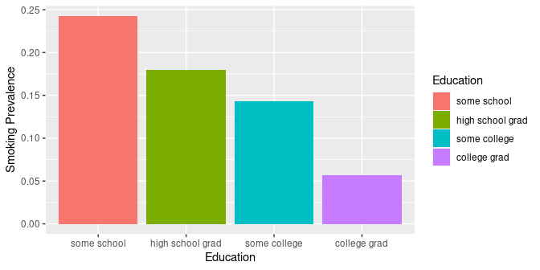

# BRFSS SQL Examples
Brian High  
2/18/2016  

## SQL Examples

This is a demo of some basic SQL `SELECT` queries using BRFSS data 
from: http://www.cdc.gov/brfss/. 

Only one table is used, so we will not need and "JOIN" statements. 

The CDC has provided a 
[codebook](http://www.cdc.gov/brfss/annual_data/2013/pdf/codebook13_llcp.pdf) 
for use in understanding variables and codes.

In particular, we will be focusing on tobacco smoking and alcohol drinking in 
the state of Washington.

## Connect to MySQL Database

We will connect to the `localhost` and `brfss` database using an `anonymous` 
account.


```r
library(RMySQL)
```

```
## Loading required package: DBI
```

```r
con <- dbConnect(MySQL(), 
                 host="localhost", 
                 username="anonymous", 
                 password="Ank7greph-", 
                 dbname="brfss")
```

## Count Smokers by Education Level

We can check the `USENOW3` variable to see if the survey respondent is
a smoker or not. A value of `1` (Every day) or `2` (Some days) means 
"is a smoker". We will restrict the year (`IYEAR`) to `2014` and the 
state (`X_STATE`) to `53` ("Washington"). The education level 
(`X_EDUCAG`) is an integer from 1-6.


```r
sql <- "SELECT X_EDUCAG AS Education, count(USENOW3) AS Smokers 
        FROM brfss 
        WHERE IYEAR = 2014 
              AND X_STATE = 53 
              AND (USENOW3 = 1 OR USENOW3 = 2) 
              AND X_EDUCAG <= 4 
        GROUP BY X_EDUCAG 
        ORDER BY X_EDUCAG DESC;"

rs <- dbGetQuery(con, sql)
rs
```

```
##   Education Smokers
## 1         4      57
## 2         3      74
## 3         2      83
## 4         1      16
```

## Relabel Education Level

We will relabel the codes for education level to have meaningful labels. We will
abbreviate the "Value Label" text descriptions from the codebook as follows.


```r
edu.labels <- c("some school", "high school grad", 
                "some college", "college grad")
rs$Education <- factor(rs$Education, levels=1:4, labels=edu.labels)
rs
```

```
##          Education Smokers
## 1     college grad      57
## 2     some college      74
## 3 high school grad      83
## 4      some school      16
```

## Smokers by Education Level


```r
library(ggplot2)
ggplot(data=rs, aes(x=Education, y=Smokers, fill=Education)) +
    geom_bar(stat="identity")
```

\


## Smokers by Education Level and Year

How has smoking changed from 2013 to 2014?


```r
sql <- "SELECT IYEAR AS Year, X_EDUCAG AS Education, count(USENOW3) AS Smokers
        FROM brfss 
        WHERE (IYEAR = 2014 OR IYEAR = 2013)
              AND X_STATE = 53 
              AND (USENOW3 = 1 OR USENOW3 = 2) 
              AND X_EDUCAG <= 4 
        GROUP BY IYEAR, X_EDUCAG 
        ORDER BY IYEAR, X_EDUCAG DESC;"

rs <- dbGetQuery(con, sql)
rs$Education <- factor(rs$Education, levels=1:4, labels=edu.labels)
```

## Smokers by Education Level and Year


```r
rs$Year <- factor(rs$Year)
ggplot(data=rs, aes(x=Education, y=Smokers, fill=Year)) +
    geom_bar(stat="identity", position=position_dodge(), colour="black")
```

\


## Count Drinkers by Education Level

The `DRNKANY5` variable stores a value indicating if the survey respondent has 
consumed an alcoholic drink in the past 30 days. We will use this value to 
indicate if the survey respondent is currently a drinker or not. A value of
`1` means "is a drinker". Again, we will just look at Washington state in 2013.


```r
sql <- "SELECT X_EDUCAG AS Education, count(DRNKANY5) AS Drinkers 
        FROM brfss 
        WHERE IYEAR = 2014
              AND X_STATE = 53 
              AND DRNKANY5 = 1 
              AND X_EDUCAG <= 4 
        GROUP BY X_EDUCAG 
        ORDER BY X_EDUCAG DESC;"

rs <- dbGetQuery(con, sql)
rs$Education <- factor(rs$Education, levels=1:4, labels=edu.labels)
rs
```

```
##          Education Drinkers
## 1     college grad     2947
## 2     some college     1646
## 3 high school grad     1058
## 4      some school      162
```

## Drinkers by Education Level


```r
ggplot(data=rs, aes(x=Education, y=Drinkers, fill=Education)) +
    geom_bar(stat="identity")
```

\


## Drinkers by Education Level and Year

Let's see how drinking in 2013 compares to 2014.


```r
sql <- "SELECT IYEAR AS Year, X_EDUCAG AS Education, count(DRNKANY5) AS Drinkers 
        FROM brfss 
        WHERE (IYEAR = 2014 OR IYEAR = 2013)
              AND X_STATE = 53 
              AND DRNKANY5 = 1 
              AND X_EDUCAG <= 4 
        GROUP BY IYEAR, X_EDUCAG 
        ORDER BY IYEAR, X_EDUCAG DESC;"

rs <- dbGetQuery(con, sql)
rs$Education <- factor(rs$Education, levels=1:4, labels=edu.labels)
```

## Drinkers by Education Level and Year


```r
rs$Year <- factor(rs$Year)
ggplot(data=rs, aes(x=Education, y=Drinkers, fill=Year)) +
    geom_bar(stat="identity", position=position_dodge(), colour="black")
```

\


## Smokers by Year

We can get a count of all smokers by year to look for annual trends.


```r
sql <- "SELECT IYEAR as Year, count(USENOW3) AS Smokers 
        FROM brfss 
        WHERE IYEAR <= 2014 
              AND X_STATE = 53 
              AND (USENOW3 = 1 OR USENOW3 = 2) 
        GROUP BY IYEAR 
        ORDER BY IYEAR;"

rs <- dbGetQuery(con, sql)
rs$Year <- factor(rs$Year)
smokers <- rs
head(smokers)
```

```
##   Year Smokers
## 1 2012     388
## 2 2013     283
## 3 2014     233
```

## Drinkers by Year

The trend for drinkers is similar, though there are many more drinkers.


```r
sql <- "SELECT IYEAR as Year, count(DRNKANY5) AS Drinkers 
        FROM brfss 
        WHERE IYEAR <= 2014
              AND X_STATE = 53 
              AND DRNKANY5 = 1 
        GROUP BY IYEAR 
        ORDER BY IYEAR;"

rs <- dbGetQuery(con, sql)
rs$Year <- factor(rs$Year)
drinkers <- rs
head(drinkers)
```

```
##   Year Drinkers
## 1 2012     8976
## 2 2013     6420
## 3 2014     5819
```

## Smokers and Drinkers by Year

We can compare smokers and drinkers by merging the two datasets.


```r
consumers <- merge(smokers, drinkers, "Year")
head(consumers)
```

```
##   Year Smokers Drinkers
## 1 2012     388     8976
## 2 2013     283     6420
## 3 2014     233     5819
```

## Smokers and Drinkers in Long Format

To facilitate plotting, we will want to group by consumption type. To do this,
we will need to convert the data structure from wide to long format. The
`gather()` function of the `tidyr` package makes this easy.


```r
library(tidyr)
consumers <- gather(consumers, key=Type, value=Count, -Year)
head(consumers)
```

```
##   Year     Type Count
## 1 2012  Smokers   388
## 2 2013  Smokers   283
## 3 2014  Smokers   233
## 4 2012 Drinkers  8976
## 5 2013 Drinkers  6420
## 6 2014 Drinkers  5819
```

## Smokers and Drinkers by Year


```r
ggplot(data=consumers, aes(x=Year, y=Count, group=Type, color=Type)) +
    geom_line()
```

\


## Close Database Connection

Since we are done with the database, we can close the connect to it.


```r
# Close connection
dbDisconnect(con)
```

```
## [1] TRUE
```
