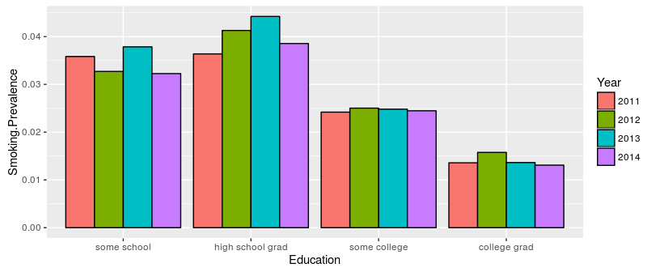

# Smoking and Drinking
Brian High  
2/19/2016  

## SQL Examples: Smoking and Drinking

This is a demo of some basic SQL `SELECT` queries using BRFSS data 
from: http://www.cdc.gov/brfss/. 

Only one table is used, so we will not need any "JOIN" statements. 

We have downloaded the data for each respondent for the years 2005 through 2014.

The data is stored in a MySQL database with 4379516 rows and 999 columns. When
exported as a TSV file, this file is 13 GB. This dataset will be too large to
fit in RAM memory for most desktop and laptop computers.

The CDC has provided a 
[codebook](http://www.cdc.gov/brfss/annual_data/2014/pdf/codebook14_llcp.pdf) 
for use in understanding variables and codes.

In particular, we will focus on tobacco use and alcohol consumption in 
the state of Washington.

## Connect to MySQL Database

We will connect to the `localhost` and `brfss` database using an `anonymous` 
account.


```r
library(RMySQL)

con <- dbConnect(MySQL(), 
                 host="localhost", 
                 username="anonymous", 
                 password="Ank7greph-", 
                 dbname="brfss")
```

It's generally a *bad* idea to put your connection credentials in your script,
and an even *worse* idea to publish these on Github. *Don't be like me!*


```r
if (file.exists("con.R")) source("con.R")
```

A lesser evil is to put them in a separate file that you keep secure and private.

Even better would be to configure your system to prompt you for the password.

## Count Smokers by Education Level

We can check the `USENOW3` variable to see if the survey respondent is
a smoker or not. A value of `1` (Every day) or `2` (Some days) means 
"is a smoker". We will restrict the year (`IYEAR`) to `2014` and the 
state (`X_STATE`) to `53` ("Washington"). The education level 
(`X_EDUCAG`) is an integer from 1-4 (or 9 meaning "Don't know", "Missing", etc.).


```r
sql <- "SELECT COUNT(*) AS TOTAL, 
        X_EDUCAG AS Education, 
        COUNT(IF(USENOW3 = 1 OR USENOW3 = 2, 1, NULL)) AS Smokers 
        FROM brfss 
        WHERE IYEAR = 2014 
              AND X_STATE = 53 
              AND X_EDUCAG <= 4 
        GROUP BY X_EDUCAG 
        ORDER BY X_EDUCAG DESC;"

rs <- dbGetQuery(con, sql)
```

## Smoking Prevalence by Education Level

We then use functions from the package `dplyr` to calculate smoking prevalence.


```r
library(dplyr)
rs %>% group_by(Education) %>% mutate(Smoking.Prevalence=Smokers/TOTAL) -> smokers
smokers
```

```
## Source: local data frame [4 x 4]
## Groups: Education [4]
## 
##   TOTAL Education Smokers Smoking.Prevalence
##   (dbl)     (int)   (dbl)              (dbl)
## 1  4353         4      57         0.01309442
## 2  3023         3      74         0.02447899
## 3  2153         2      83         0.03855086
## 4   496         1      16         0.03225806
```

## Relabel Education Level

Now, we relabel the codes for education level to have meaningful labels. We 
abbreviate the "Value Label" text descriptions from the codebook as follows.


```r
edu.labels <- c("some school", "high school grad", 
                "some college", "college grad")
smokers$Education <- factor(smokers$Education, levels=1:4, labels=edu.labels)
smokers
```

```
## Source: local data frame [4 x 4]
## Groups: Education [4]
## 
##   TOTAL        Education Smokers Smoking.Prevalence
##   (dbl)           (fctr)   (dbl)              (dbl)
## 1  4353     college grad      57         0.01309442
## 2  3023     some college      74         0.02447899
## 3  2153 high school grad      83         0.03855086
## 4   496      some school      16         0.03225806
```

## Smoking Prevalence by Education Level


```r
library(ggplot2)
ggplot(data=smokers, aes(x=Education, y=Smoking.Prevalence, fill=Education)) +
    geom_bar(stat="identity")
```

\


## Count Smokers by Education and Year

How has smoking changed from 2011 to 2014?


```r
sql <- "SELECT IYEAR AS Year, COUNT(*) AS TOTAL, 
        X_EDUCAG AS Education, 
        COUNT(IF(USENOW3 = 1 OR USENOW3 = 2, 1, NULL)) AS Smokers
        FROM brfss 
        WHERE (IYEAR >= 2011 AND IYEAR <= 2014)
              AND X_STATE = 53 
              AND X_EDUCAG <= 4 
        GROUP BY IYEAR, X_EDUCAG 
        ORDER BY IYEAR, X_EDUCAG DESC;"

rs <- dbGetQuery(con, sql)
rs %>% group_by(Year, Education) %>% 
    mutate(Smoking.Prevalence=Smokers/TOTAL) -> smokers
```

## Smoking by Education and Year


```r
smokers$Education <- factor(smokers$Education, levels=1:4, labels=edu.labels)
smokers$Year <- factor(smokers$Year)
ggplot(data=smokers, aes(x=Education, y=Smoking.Prevalence, fill=Year)) +
    geom_bar(stat="identity", position=position_dodge(), colour="black")
```

\


## Count Drinkers by Education Level

The `DRNKANY5` variable stores a value indicating if the survey respondent has 
consumed an alcoholic drink in the past 30 days. We will use this value to 
indicate if the survey respondent is currently a drinker or not. A value of
`1` means "is a drinker". Again, we will just look at Washington state in 2014.


```r
sql <- "SELECT COUNT(*) AS TOTAL, 
        X_EDUCAG AS Education, 
        COUNT(IF(DRNKANY5 = 1, 1, NULL)) AS Drinkers 
        FROM brfss 
        WHERE IYEAR = 2014
              AND X_STATE = 53 
              AND X_EDUCAG <= 4 
        GROUP BY X_EDUCAG 
        ORDER BY X_EDUCAG DESC;"

rs <- dbGetQuery(con, sql)
```

## Drinking Prevalence by Education Level

Again, using `dplyr`, we can calculate drinking prevalence.


```r
rs %>% group_by(Education) %>% 
    mutate(Drinking.Prevalence=Drinkers/TOTAL) -> drinkers
drinkers$Education <- factor(drinkers$Education, levels=1:4, labels=edu.labels)
drinkers
```

```
## Source: local data frame [4 x 4]
## Groups: Education [4]
## 
##   TOTAL        Education Drinkers Drinking.Prevalence
##   (dbl)           (fctr)    (dbl)               (dbl)
## 1  4353     college grad     2947           0.6770044
## 2  3023     some college     1646           0.5444922
## 3  2153 high school grad     1058           0.4914073
## 4   496      some school      162           0.3266129
```

## Drinking Prevalence by Education Level


```r
ggplot(data=drinkers, aes(x=Education, y=Drinking.Prevalence, fill=Education)) +
    geom_bar(stat="identity")
```

\


## Count Drinkers by Education and Year

Let's see how drinking compares from 2011 to 2014.


```r
sql <- "SELECT IYEAR AS Year, COUNT(*) AS TOTAL, 
        X_EDUCAG AS Education, 
        COUNT(IF(DRNKANY5 = 1, 1, NULL)) AS Drinkers 
        FROM brfss 
        WHERE (IYEAR >= 2011 AND IYEAR <= 2014)
              AND X_STATE = 53 
              AND X_EDUCAG <= 4 
        GROUP BY IYEAR, X_EDUCAG 
        ORDER BY IYEAR, X_EDUCAG DESC;"

rs <- dbGetQuery(con, sql)
rs %>% group_by(Year, Education) %>% 
    mutate(Drinking.Prevalence=Drinkers/TOTAL) -> drinkers
```

## Drinking by Education and Year


```r
drinkers$Education <- factor(drinkers$Education, levels=1:4, labels=edu.labels)
drinkers$Year <- factor(drinkers$Year)
ggplot(data=drinkers, aes(x=Education, y=Drinking.Prevalence, fill=Year)) +
    geom_bar(stat="identity", position=position_dodge(), colour="black")
```

\


## Smoking and Drinking by Year

We can compare the number of smokers and drinkers by year in one query using
the SQL `IF()` function within our `COUNT()` function.


```r
sql <- "SELECT IYEAR as Year, COUNT(*) AS TOTAL,
        COUNT(IF(USENOW3 = 1 OR USENOW3 = 2, 1, NULL)) AS Smokers,
        COUNT(IF(DRNKANY5 = 1, 1, NULL)) AS Drinkers
        FROM brfss
        WHERE IYEAR >= 2011 AND IYEAR <= 2014 AND X_STATE = 53
        GROUP BY IYEAR 
        ORDER BY IYEAR;"

rs <- dbGetQuery(con, sql)
rs %>% group_by(Year) %>%
    mutate(Smoking=Smokers/TOTAL, Drinking=Drinkers/TOTAL) -> consumers
```

This saves us from otherwise having to perform two separate queries and then 
having to merge the results. We had SQL calculate yearly totals of survey
respondents to use for calculating smoking and drinking prevalence.

## Smoking and Drinking by Year

Now we can show smoking and drinking prevalenve side-by-side in "wide" format.


```r
consumers$Year <- factor(consumers$Year)
consumers
```

```
## Source: local data frame [4 x 6]
## Groups: Year [4]
## 
##     Year TOTAL Smokers Drinkers    Smoking  Drinking
##   (fctr) (dbl)   (dbl)    (dbl)      (dbl)     (dbl)
## 1   2011 14772     353     8339 0.02389656 0.5645139
## 2   2012 15319     388     8976 0.02532802 0.5859390
## 3   2013 11158     283     6420 0.02536297 0.5753719
## 4   2014 10086     233     5819 0.02310133 0.5769383
```

## Smokers and Drinkers in Long Format

To facilitate plotting, we will want to group by consumption type. To do this,
we will need to convert the data structure from "wide" to "long" format. The
`gather()` function of the `tidyr` package makes this easy.


```r
library(tidyr)
consumers <- consumers %>% 
    select(Year, Smoking, Drinking) %>% 
    gather(key=Factor, value=Prevalence, -Year)
consumers
```

```
## Source: local data frame [8 x 3]
## 
##     Year   Factor Prevalence
##   (fctr)   (fctr)      (dbl)
## 1   2011  Smoking 0.02389656
## 2   2012  Smoking 0.02532802
## 3   2013  Smoking 0.02536297
## 4   2014  Smoking 0.02310133
## 5   2011 Drinking 0.56451395
## 6   2012 Drinking 0.58593903
## 7   2013 Drinking 0.57537193
## 8   2014 Drinking 0.57693833
```

## Smoking and Drinking by Year


```r
ggplot(data=consumers, aes(x=Year, y=Prevalence, group=Factor, color=Factor)) +
    geom_line()
```

\


## Close Database Connection

Since we are done with the database, we can close the connect to it.


```r
# Close connection
dbDisconnect(con)
```

```
## [1] TRUE
```
