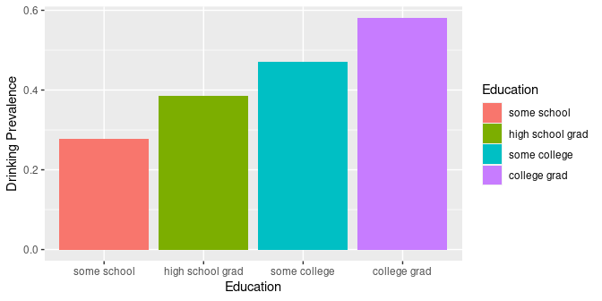

# Smoking and Drinking
Brian High  
2/19/2016  

## SQL Examples: Smoking and Drinking

This is a demo of some basic SQL `SELECT` queries using BRFSS data from: 
http://www.cdc.gov/brfss/. 

We have downloaded the data for each respondent for the years 2005 through 2014.

This dataset has 4,379,516 rows and 999 columns.

This dataset will be too large to fit in RAM memory for most desktop and laptop 
computers.

When exported as a TSV file, this file is 13 GB. When loaded into R as a data 
table, the memory consumed is almost 33 GB.

Instead, we have imported the data into a MySQL database table. We have indexed
the table on survey year and state to improve performance.

The CDC has provided a 
[codebook](http://www.cdc.gov/brfss/annual_data/2014/pdf/codebook14_llcp.pdf) 
for use in understanding variables and codes.

In particular, we will focus on tobacco use and alcohol consumption in 
the state of Washington.


## Connect to MySQL Database

We will connect to the `localhost` and `brfss` database using an `anonymous` 
account.


```r
library(RMySQL)

con <- dbConnect(MySQL(), 
                 host="localhost", 
                 username="anonymous", 
                 password="Ank7greph-", 
                 dbname="brfss")
```

It's generally a *bad* idea to put your connection credentials in your script,
and an even *worse* idea to publish these on Github. *Don't be like me!*


```r
if (file.exists("con.R")) source("con.R")
```

A lesser evil is to put them in a separate file that you keep secure and private.

Even better would be to configure your system to prompt you for the password.

## Table Size

You can find the number of rows and columns, as well as table and index size,
with a few simple queries.


```r
sql <- "SELECT COUNT(*) AS rows FROM brfss;"
rs <- dbGetQuery(con, sql)
cat(rs$rows, "rows")
```

```
## 4379516 rows
```

```r
sql <- "SELECT * FROM brfss LIMIT 1;"
rs <- dbGetQuery(con, sql)
cat(ncol(rs), "columns")
```

```
## 999 columns
```

```r
sql <- "SHOW TABLE STATUS IN brfss;"
rs <- dbGetQuery(con, sql)
cat(sum(rs[1, c("Data_length", "Index_length")]) / 1024 / 1024 / 1024, "GB")
```

```
## 4.214142 GB
```

## Count Respondents per Year

Usually, aggregating functions like `COUNT()` are used with `GROUP BY`. Let's
count the number of respondents per year in Washington state (`53`). `ORDER BY` 
is for sorting.


```r
sql <- "SELECT IYEAR AS Year, COUNT(*) AS Respondents 
        FROM brfss 
        WHERE X_STATE = 53 
        GROUP BY IYEAR 
        ORDER BY IYEAR;"
rs <- dbGetQuery(con, sql)
rs
```

```
##    Year Respondents
## 1  2005       23302
## 2  2006       23760
## 3  2007       25881
## 4  2008       22532
## 5  2009       20294
## 6  2010       19628
## 7  2011       14772
## 8  2012       15319
## 9  2013       11158
## 10 2014       10086
## 11 2015          10
```

## Respondents per Education Level

Since 2015 has very few respondents in our dataset, we will use as 2014 as
the most recent year. To get a idea of our sample, we look at education level.


```r
sql <- "SELECT X_EDUCAG AS Education, COUNT(*) AS Respondents 
        FROM brfss 
        WHERE IYEAR = 2014 AND X_STATE = 53 
        GROUP BY X_EDUCAG 
        ORDER BY X_EDUCAG;"
rs <- dbGetQuery(con, sql)
rs
```

```
##   Education Respondents
## 1         1         496
## 2         2        2153
## 3         3        3023
## 4         4        4353
## 5         9          61
```

The education level (`X_EDUCAG`) is an integer from 1-4 (or 9 meaning 
"Don't know", "Missing", etc.). What trend do we see here?

## Count Smokers by Education Level

We can check the `USENOW3` variable to see if the survey respondent is
a smoker or not. A value of `1` (Every day) or `2` (Some days) means 
"is a smoker".


```r
sql <- "SELECT X_EDUCAG AS Education, 
        COUNT(USENOW3) AS Smokers 
        FROM brfss 
        WHERE IYEAR = 2014 
              AND X_STATE = 53 
              AND X_EDUCAG <= 4 
              AND (USENOW3 = 1 OR USENOW3 = 2) 
        GROUP BY X_EDUCAG 
        ORDER BY X_EDUCAG;"
rs <- dbGetQuery(con, sql)
rs
```

```
##   Education Smokers
## 1         1      16
## 2         2      83
## 3         3      74
## 4         4      57
```

Since the number of respondents varies by education level, we will want to 
calculate "prevalence" using respondent totals by education level.

## Count Smokers by Education Level

We can get a count of smokers and total respondents per education level in one 
query by using the `IF()` function within the `COUNT()` function.


```r
sql <- "SELECT X_EDUCAG AS Education, 
        COUNT(*) AS Respondents, 
        COUNT(IF(USENOW3 = 1 OR USENOW3 = 2, 1, NULL)) AS Smokers 
        FROM brfss 
        WHERE IYEAR = 2014 
              AND X_STATE = 53 
              AND X_EDUCAG <= 4 
        GROUP BY X_EDUCAG 
        ORDER BY X_EDUCAG;"
rs <- dbGetQuery(con, sql)
rs
```

```
##   Education Respondents Smokers
## 1         1         496      16
## 2         2        2153      83
## 3         3        3023      74
## 4         4        4353      57
```

The `IF()` condition `USENOW3 = 1 OR USENOW3 = 2` was taken from the `WHERE` 
clause. We had to make this change so that `COUNT(*)` counts all respondents.

## Smoking Prevalence by Education Level

We use functions from the `dplyr` package to calculate smoking prevalence. This
is the number of smokers as a fraction of respondents for each education level.


```r
library(dplyr)
rs %>% group_by(Education) %>% 
    mutate(Smoking.Prevalence=Smokers/Respondents) -> smokers
smokers
```

```
## Source: local data frame [4 x 4]
## Groups: Education [4]
## 
##   Education Respondents Smokers Smoking.Prevalence
##       (int)       (dbl)   (dbl)              (dbl)
## 1         1         496      16         0.03225806
## 2         2        2153      83         0.03855086
## 3         3        3023      74         0.02447899
## 4         4        4353      57         0.01309442
```

## Relabel Education Level

Now, we relabel the codes for education level to meaningful text strings. We 
abbreviate the "Value Label" text descriptions from the codebook as follows.


```r
edu.labels <- c("some school", "high school grad", 
                "some college", "college grad")
smokers$Education <- factor(smokers$Education, levels=1:4, labels=edu.labels)
smokers
```

```
## Source: local data frame [4 x 4]
## Groups: Education [4]
## 
##          Education Respondents Smokers Smoking.Prevalence
##             (fctr)       (dbl)   (dbl)              (dbl)
## 1      some school         496      16         0.03225806
## 2 high school grad        2153      83         0.03855086
## 3     some college        3023      74         0.02447899
## 4     college grad        4353      57         0.01309442
```

## Smoking Prevalence by Education Level


```r
library(ggplot2)
ggplot(data=smokers, aes(x=Education, y=Smoking.Prevalence, fill=Education)) +
    geom_bar(stat="identity")
```

\


## Count Smokers by Education and Year

How has smoking changed from 2011 to 2014?


```r
sql <- "SELECT IYEAR AS Year, X_EDUCAG AS Education, 
        COUNT(*) AS Respondents, 
        COUNT(IF(USENOW3 = 1 OR USENOW3 = 2, 1, NULL)) AS Smokers
        FROM brfss 
        WHERE (IYEAR >= 2011 AND IYEAR <= 2014)
              AND X_STATE = 53 
              AND X_EDUCAG <= 4 
        GROUP BY IYEAR, X_EDUCAG 
        ORDER BY IYEAR, X_EDUCAG DESC;"

rs <- dbGetQuery(con, sql)
rs %>% group_by(Year, Education) %>% 
    mutate(Smoking.Prevalence=Smokers/Respondents) -> smokers
```

## Smoking by Education and Year


```r
smokers$Education <- factor(smokers$Education, levels=1:4, labels=edu.labels)
smokers$Year <- factor(smokers$Year)
ggplot(data=smokers, aes(x=Education, y=Smoking.Prevalence, fill=Year)) +
    geom_bar(stat="identity", position=position_dodge(), colour="black")
```

\


## Count Drinkers by Education Level

The `DRNKANY5` variable stores a value indicating if the survey respondent has 
consumed an alcoholic drink in the past 30 days. We will use this value to 
indicate if the survey respondent is currently a drinker or not. A value of
`1` means "is a drinker". Again, we will just look at Washington state in 2014.


```r
sql <- "SELECT X_EDUCAG AS Education, 
        COUNT(*) AS Respondents, 
        COUNT(IF(DRNKANY5 = 1, 1, NULL)) AS Drinkers 
        FROM brfss 
        WHERE IYEAR = 2014
              AND X_STATE = 53 
              AND X_EDUCAG <= 4 
        GROUP BY X_EDUCAG 
        ORDER BY X_EDUCAG DESC;"

rs <- dbGetQuery(con, sql)
```

## Drinking Prevalence by Education Level

Again, using `dplyr`, we can calculate drinking prevalence.


```r
rs %>% group_by(Education) %>% 
    mutate(Drinking.Prevalence=Drinkers/Respondents) -> drinkers
drinkers$Education <- factor(drinkers$Education, levels=1:4, labels=edu.labels)
drinkers
```

```
## Source: local data frame [4 x 4]
## Groups: Education [4]
## 
##          Education Respondents Drinkers Drinking.Prevalence
##             (fctr)       (dbl)    (dbl)               (dbl)
## 1     college grad        4353     2947           0.6770044
## 2     some college        3023     1646           0.5444922
## 3 high school grad        2153     1058           0.4914073
## 4      some school         496      162           0.3266129
```

## Drinking Prevalence by Education Level


```r
ggplot(data=drinkers, aes(x=Education, y=Drinking.Prevalence, fill=Education)) +
    geom_bar(stat="identity")
```

\


## Count Drinkers by Education and Year

Let's see how drinking compares from 2011 to 2014.


```r
sql <- "SELECT IYEAR AS Year, X_EDUCAG AS Education, 
        COUNT(*) AS Respondents, 
        COUNT(IF(DRNKANY5 = 1, 1, NULL)) AS Drinkers 
        FROM brfss 
        WHERE (IYEAR >= 2011 AND IYEAR <= 2014)
              AND X_STATE = 53 
              AND X_EDUCAG <= 4 
        GROUP BY IYEAR, X_EDUCAG 
        ORDER BY IYEAR, X_EDUCAG DESC;"

rs <- dbGetQuery(con, sql)
rs %>% group_by(Year, Education) %>% 
    mutate(Drinking.Prevalence=Drinkers/Respondents) -> drinkers
```

## Drinking by Education and Year


```r
drinkers$Education <- factor(drinkers$Education, levels=1:4, labels=edu.labels)
drinkers$Year <- factor(drinkers$Year)
ggplot(data=drinkers, aes(x=Education, y=Drinking.Prevalence, fill=Year)) +
    geom_bar(stat="identity", position=position_dodge(), colour="black")
```

\


## Why so many queries?

We could have retrieved all of the data for the previous plots with a single
query:


```r
sql <- "SELECT IYEAR AS Year, X_EDUCAG AS Education, 
        COUNT(*) AS Respondents, 
        COUNT(IF(USENOW3 = 1 OR USENOW3 = 2, 1, NULL)) AS Smokers, 
        COUNT(IF(DRNKANY5 = 1, 1, NULL)) AS Drinkers 
        FROM brfss 
        WHERE (IYEAR >= 2011 AND IYEAR <= 2014)
              AND X_STATE = 53 
              AND X_EDUCAG <= 4 
        GROUP BY IYEAR, X_EDUCAG 
        ORDER BY IYEAR, X_EDUCAG;"

rs <- dbGetQuery(con, sql)
rs %>% group_by(Year, Education) %>% 
    mutate(Smoking=Smokers/Respondents, 
           Drinking=Drinkers/Respondents) -> consumers
consumers$Education <- factor(consumers$Education, levels=1:4, 
                              labels=edu.labels)
consumers$Year <- factor(consumers$Year)
```

From this dataframe, just subset as needed to produce tables and plots.

## Smoking and Drinking Prevalence


```r
consumers %>% head(8) %>% kable(digits=3)
```


Year   Education           Respondents   Smokers   Drinkers   Smoking   Drinking
-----  -----------------  ------------  --------  ---------  --------  ---------
2011   some school                 893        32        309     0.036      0.346
2011   high school grad           3491       127       1654     0.036      0.474
2011   some college               4670       113       2553     0.024      0.547
2011   college grad               5668        77       3817     0.014      0.673
2012   some school                 856        28        291     0.033      0.340
2012   high school grad           3512       145       1700     0.041      0.484
2012   some college               4635       116       2650     0.025      0.572
2012   college grad               6280        99       4330     0.016      0.689

## Smoking and Drinking in Long Format

To facilitate plotting, we will want to group by consumption type. To do this,
we will need to convert the data structure from "wide" to "long" format. The
`gather()` function of the `tidyr` package makes this easy.


```r
library(tidyr)
consumers <- consumers %>% 
    select(Year, Education, Smoking, Drinking) %>% 
    gather(key=Factor, value=Prevalence, -Year, -Education)
head(consumers, 8)
```

```
## Source: local data frame [8 x 4]
## 
##     Year        Education  Factor Prevalence
##   (fctr)           (fctr)  (fctr)      (dbl)
## 1   2011      some school Smoking 0.03583427
## 2   2011 high school grad Smoking 0.03637926
## 3   2011     some college Smoking 0.02419700
## 4   2011     college grad Smoking 0.01358504
## 5   2012      some school Smoking 0.03271028
## 6   2012 high school grad Smoking 0.04128702
## 7   2012     some college Smoking 0.02502697
## 8   2012     college grad Smoking 0.01576433
```

## Smoking and Drinking Prevalence


```r
ggplot(data=consumers, aes(x=Year, y=Prevalence, group=Factor, color=Factor)) + 
    geom_line() + facet_grid(Factor ~ Education, scales="free_y")
```

\


## Compare other Variables

Now that you know how to query the database, compare other variables, such as:

- Smoking and drinking by income (`X_INCOMG`) or race (`X_RACE`)
- Binge drinking (`X_RFBING5`) by gender (`SEX`) or age (`X_AGE80`)
- BMI category (`X_BMI5CAT`) and exercise (`EXERANY2`) or sleep (`SLEPTIM1`)
- Internet use (`INTERNET`) and mental health (`MENTHLTH`) or 

## Close Database Connection

Once we are done with the database, we can close the connection to it.


```r
# Close connection
dbDisconnect(con)
```

```
## [1] TRUE
```
